<div align="center">

# 🎬 Quantum Cinema

### Making the Invisible Visible Through Generative World Models

[](https://github.com/QuantBlockchain/quantum-cinema/actions/workflows/ci.yml)
[](LICENSE)
[](https://nextjs.org/)
[](https://react.dev/)
[](https://aws.amazon.com/cdk/)
[](SUPPLEMENTARY.md)

<p>
  <a href="https://nextjs.org/"></a>
  <a href="https://react.dev/"></a>
  <a href="https://aws.amazon.com/cdk/"></a>
  <a href="https://www.framer.com/motion/"></a>
  <a href="https://tailwindcss.com/"></a>
  
</p>

<p>
  <a href="#overview">Overview</a> ·
  <a href="#features">Features</a> ·
  <a href="#architecture">Architecture</a> ·
  <a href="#world-models-documentation">World Models</a> ·
  <a href="#quick-start">Quick Start</a> ·
  <a href="#reproducibility">Reproducibility</a> ·
  <a href="#supplementary-material">Supplementary material</a> ·
  <a href="#glossary">Glossary</a> ·
  <a href="#license">License</a>
</p>

---

> **Quantum Cinema** turns hidden quantum hardware into a cinematic browser experience. It combines generative world models, AWS Braket device metrics, and a guided four-step interface to support science communication and academic reproducibility.

</div>

---
<a id="overview"></a>

## Overview

<table style="width:100%;border-collapse:collapse;">
  <thead>
    <tr>
      <th style="text-align:center;padding:8px;border-bottom:1px solid #eee;">Ion-trap</th>
      <th style="text-align:center;padding:8px;border-bottom:1px solid #eee;">Superconducting</th>
      <th style="text-align:center;padding:8px;border-bottom:1px solid #eee;">Neutral-atom</th>
    </tr>
  </thead>
  <tbody>
    <tr>
      <td style="text-align:center;padding:8px;"><a href="docs/world-models/ion-trap/ion-trap-screenshots/ion-1.jpg">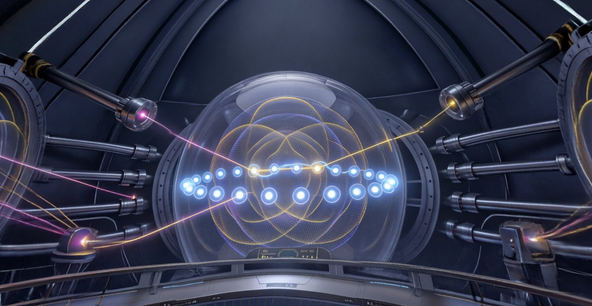</a></td>
      <td style="text-align:center;padding:8px;"><a href="docs/world-models/superconducting/superconducting-screenshots/super-1.jpg">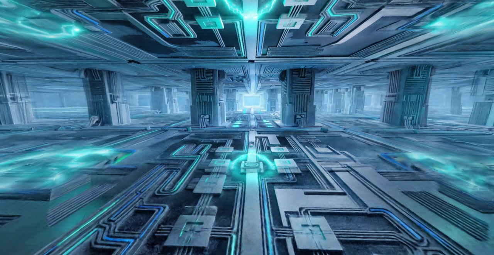</a></td>
      <td style="text-align:center;padding:8px;"><a href="docs/world-models/neutral-atoms/neutral-atom-screenshots/atom-1.jpg">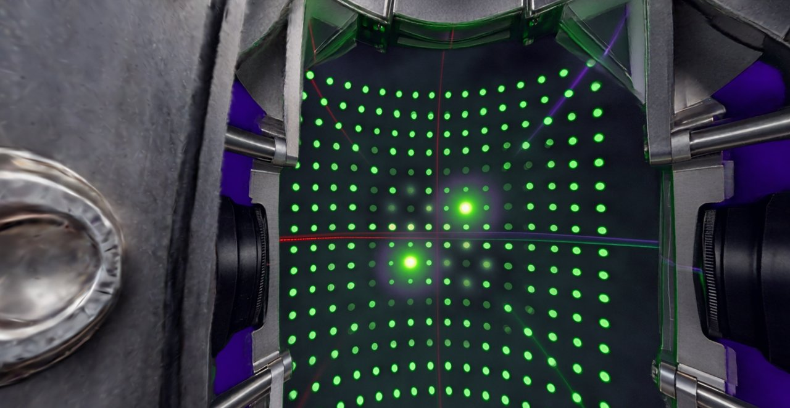</a></td>
    </tr>
    <tr>
      <td style="text-align:center;padding:8px;"><a href="docs/world-models/ion-trap/ion-trap-screenshots/ion-2.jpg">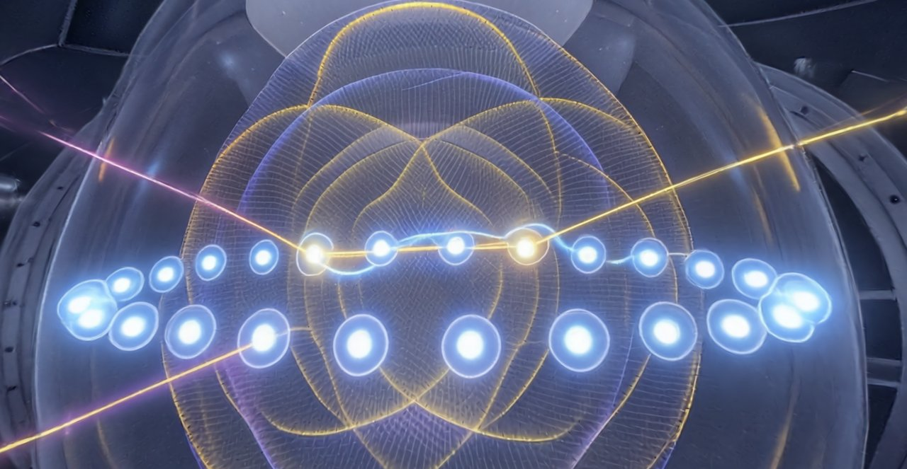</a></td>
      <td style="text-align:center;padding:8px;"><a href="docs/world-models/superconducting/superconducting-screenshots/super-2.jpg">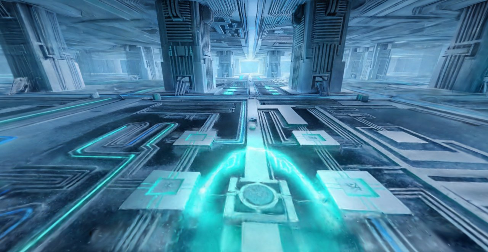</a></td>
      <td style="text-align:center;padding:8px;"><a href="docs/world-models/neutral-atoms/neutral-atom-screenshots/atom-2.jpg">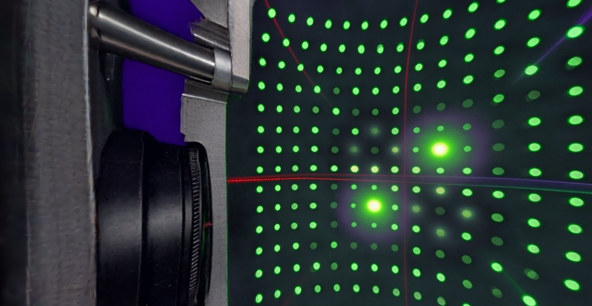</a></td>
    </tr>
    <tr>
      <td style="text-align:center;padding:8px;"><a href="docs/world-models/ion-trap/ion-trap-screenshots/ion-3.jpg">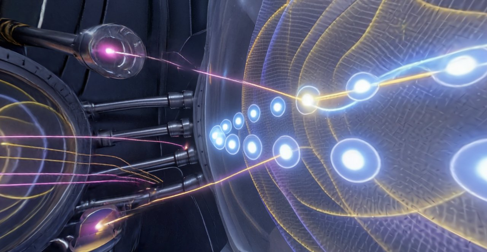</a></td>
      <td style="text-align:center;padding:8px;"><a href="docs/world-models/superconducting/superconducting-screenshots/super-3.jpg">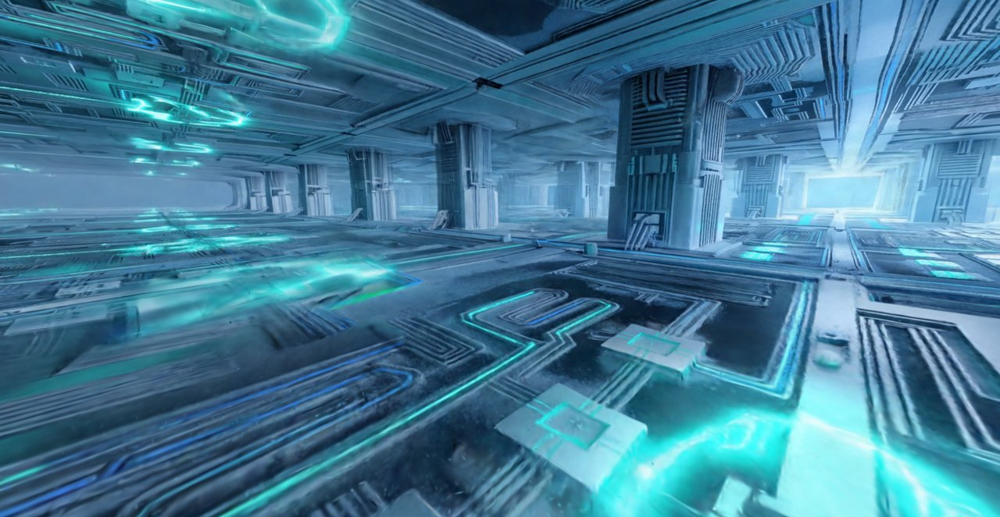</a></td>
      <td style="text-align:center;padding:8px;"><a href="docs/world-models/neutral-atoms/neutral-atom-screenshots/atom-3.jpg">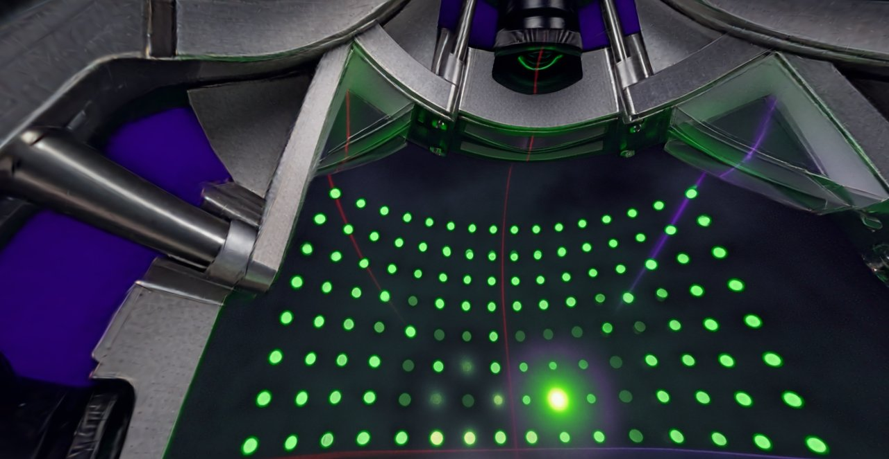</a></td>
    </tr>
    <tr>
      <td style="text-align:center;padding:8px;"><a href="docs/world-models/ion-trap/ion-trap-screenshots/ion-4.jpg">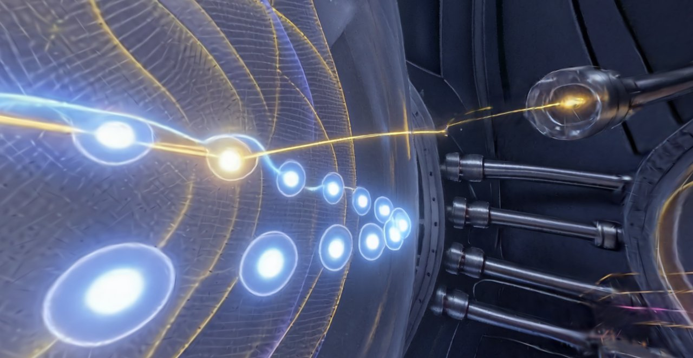</a></td>
      <td style="text-align:center;padding:8px;"><a href="docs/world-models/superconducting/superconducting-screenshots/super-4.jpg">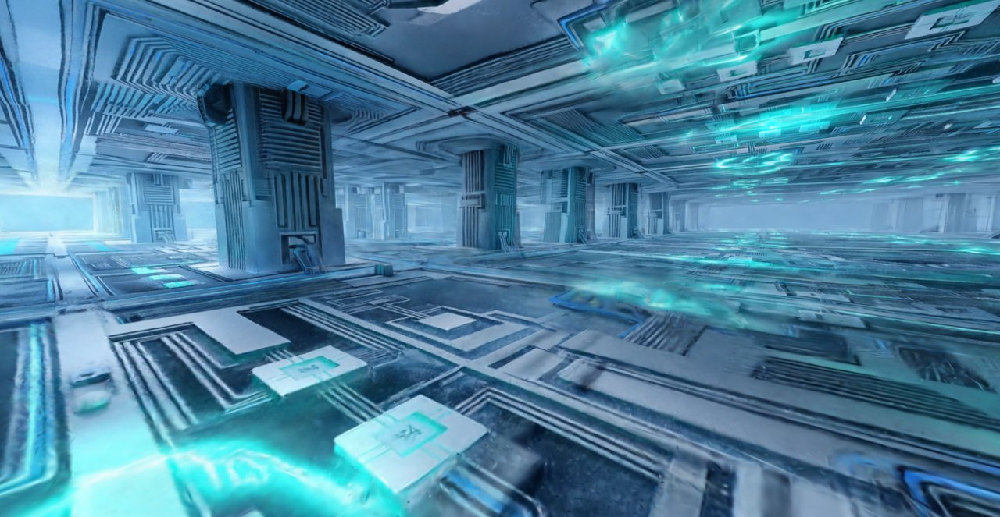</a></td>
      <td style="text-align:center;padding:8px;"><a href="docs/world-models/neutral-atoms/neutral-atom-screenshots/atom-4.jpg">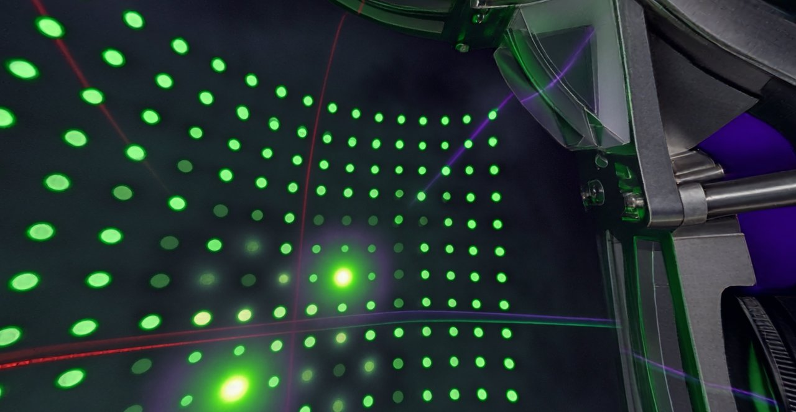</a></td>
    </tr>
    <tr>
      <td style="text-align:center;padding:8px;"><a href="docs/world-models/ion-trap/ion-trap-screenshots/ion-5.jpg">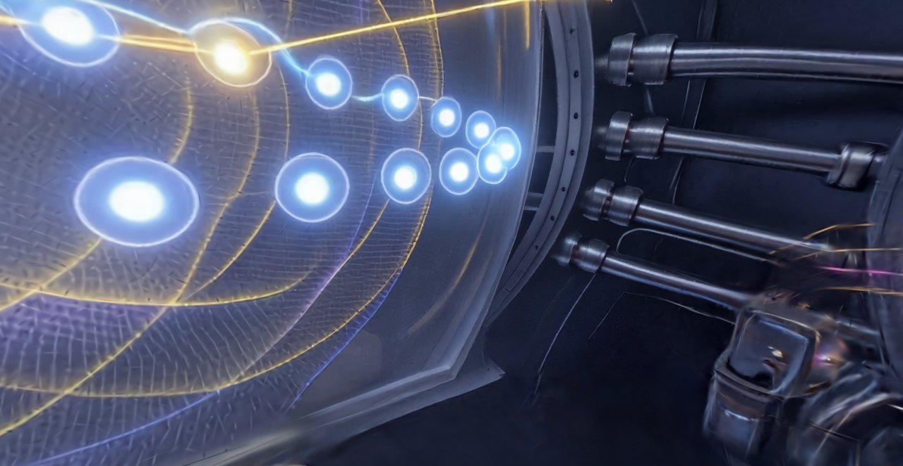</a></td>
      <td style="text-align:center;padding:8px;"><a href="docs/world-models/superconducting/superconducting-screenshots/super-5.jpg">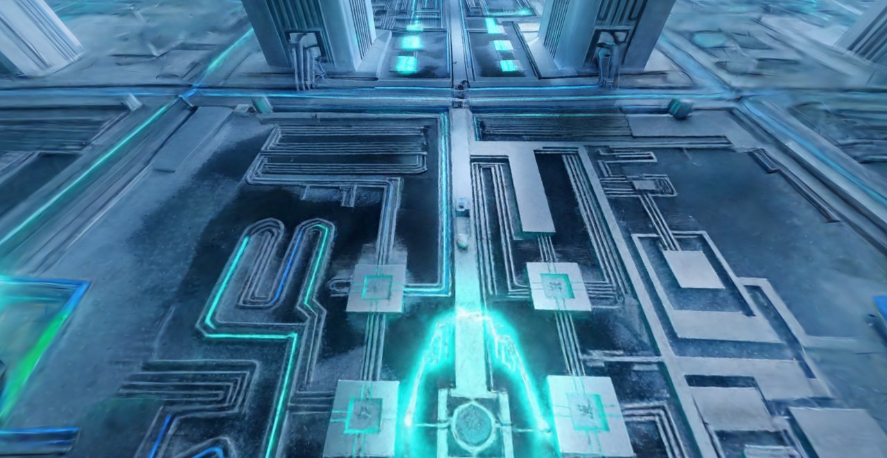</a></td>
      <td style="text-align:center;padding:8px;"><a href="docs/world-models/neutral-atoms/neutral-atom-screenshots/atom-5.jpg">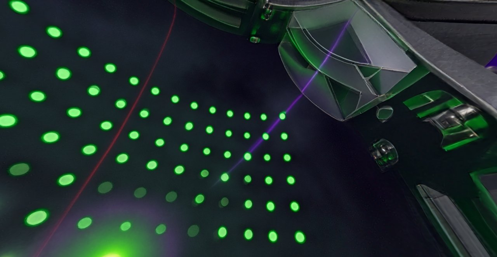</a></td>
    </tr>
    <tr>
      <td style="text-align:center;padding:8px;"><a href="docs/world-models/ion-trap/nano-banana-output.jpg">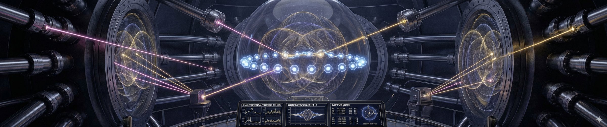</a></td>
      <td style="text-align:center;padding:8px;"><a href="docs/world-models/superconducting/nano-banana-output.jpg">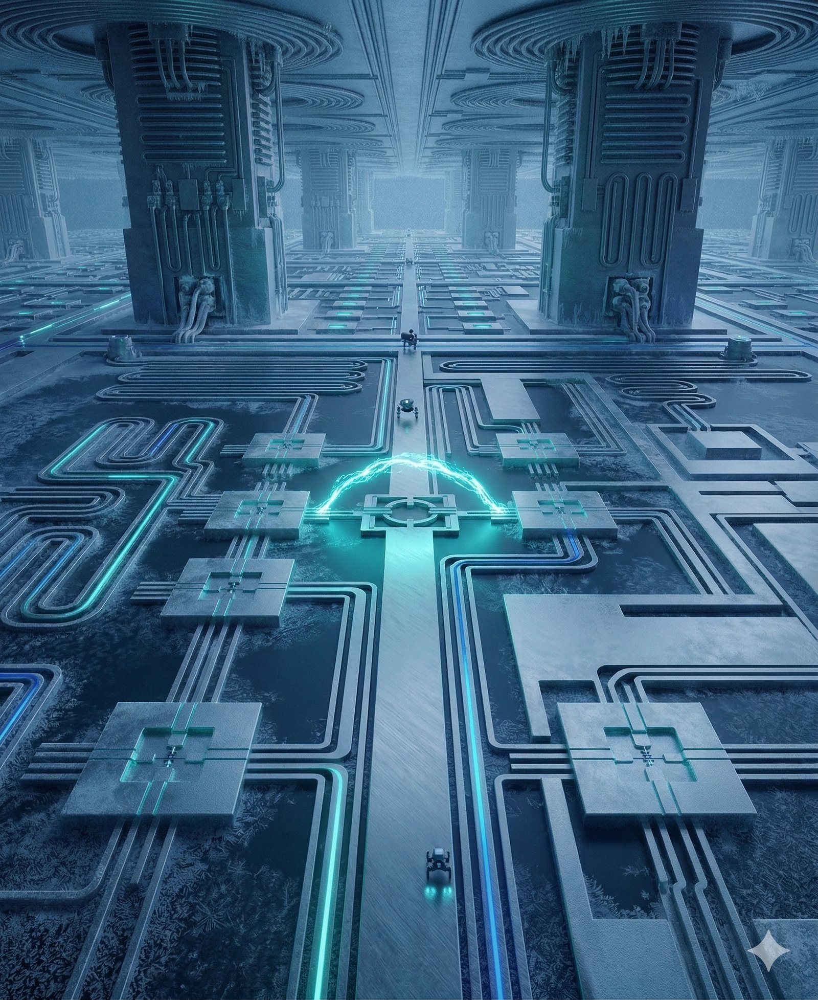</a></td>
      <td style="text-align:center;padding:8px;"><a href="docs/world-models/neutral-atoms/nano-banana-output.jpg">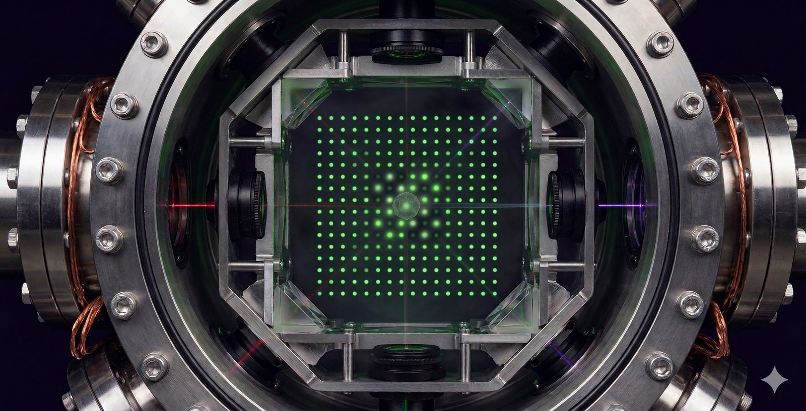</a></td>
    </tr>
  </tbody>
</table>

*A science-meets-art preview gallery from the Quantum Cinema world-model pipeline, illustrating the project’s focus on quantum hardware, narrative visualization, and frontier research communication.*

Quantum Cinema is a reproducible software artifact for academic publication. It demonstrates how immersive, browser-based visualizations can make quantum device architecture and performance legible to a broad audience.

### What this repository includes

- `quantum-cinema/` — Next.js 16 application
- `lib/` — AWS CDK infrastructure definition
- `bin/` — CDK deploy entrypoint
- `.github/workflows/ci.yml` — automated validation workflow
- `SUPPLEMENTARY.md` — reproducibility and provenance guide
- `CITATION.cff` — citation metadata for academic use

<a id="features"></a>

## Features

- Four-act immersive narrative flow: Nobel Prize → video showcase → world model → comparison
- Generative world models that map to three real AWS Braket device architectures
- AWS deployment with ECS Fargate, ALB, and CloudFront
- Security controls including ALB secret-header validation and modern HTTP headers
- Paper-ready artifact with reproducibility and citation metadata

<a id="world-models-documentation"></a>

## World Models Documentation

The world-model documentation is located under `docs/world-models/` and includes the three technical note categories requested by the engineering team:

- creation pipeline documentation (reference images, Nano-Banana concept generation, Marble 3D world creation)
- teaching story assets and screenshot galleries that explain the visual metaphors and entanglement behavior
- parameter analysis and cross-device comparison guidance using AWS Braket metrics

- `docs/world-models/ion-trap/` — Ion-trap creation pipeline, teaching story, screenshots, and Marble world reference
- `docs/world-models/superconducting/` — Superconducting creation pipeline, teaching story, screenshots, and Marble world reference
- `docs/world-models/neutral-atoms/` — Neutral-atom creation pipeline, teaching story, screenshots, and Marble world reference
- `docs/world-models/architectural-contrast.md` — cross-platform summary of the three world-model approaches
- `docs/world-models/significance-analysis.md` — AWS Braket parameter analysis, conveyed metrics, future directions, and cross-device comparison guidance
- `docs/world-models/README.md` — summary of the world-model documentation package

### Sample world-model assets

The following table presents each platform’s creation pipeline, autoplay preview video, and representative captured frame.

<table>
  <thead>
    <tr>
      <th>Platform</th>
      <th>Creation pipeline</th>
      <th>Autoplay preview</th>
      <th>Sample frame</th>
    </tr>
  </thead>
  <tbody>
    <tr>
      <td><strong>Ion-trap</strong></td>
      <td><a href="docs/world-models/ion-trap/how-to-create-world.md#how-the-final-world-model-was-generated">How the final world model was generated</a></td>
      <td>
        <a href="https://raw.githubusercontent.com/QuantBlockchain/quantum-cinema/main/quantum-cinema/public/videos/ionq-world-explore.mp4" target="_blank" rel="noopener">
          
        </a>
        <div style="font-size:12px;color:#666;margin-top:6px;">Click thumbnail to open hosted MP4 preview</div>
      </td>
      <td></td>
    </tr>
    <tr>
      <td><strong>Superconducting</strong></td>
      <td><a href="docs/world-models/superconducting/how-to-create-world.md">How the final world model was generated</a></td>
      <td>
        <a href="https://raw.githubusercontent.com/QuantBlockchain/quantum-cinema/main/quantum-cinema/public/videos/superconducting-world-explore.mp4" target="_blank" rel="noopener">
          
        </a>
        <div style="font-size:12px;color:#666;margin-top:6px;">Click thumbnail to open hosted MP4 preview</div>
      </td>
      <td></td>
    </tr>
    <tr>
      <td><strong>Neutral-atom</strong></td>
      <td><a href="docs/world-models/neutral-atoms/how-to-create-world.md">How the final world model was generated</a></td>
      <td>
        <a href="https://raw.githubusercontent.com/QuantBlockchain/quantum-cinema/main/quantum-cinema/public/videos/quera.mp4" target="_blank" rel="noopener">
          
        </a>
        <div style="font-size:12px;color:#666;margin-top:6px;">Click thumbnail to open hosted MP4 preview</div>
      </td>
      <td></td>
    </tr>
  </tbody>
</table>

If preview videos do not render in GitHub, open the MP4s directly:

- <a href="https://raw.githubusercontent.com/QuantBlockchain/quantum-cinema/main/docs/world-models/ion-trap/ionq-world-explore.mp4">Ion-trap MP4</a>
- <a href="https://raw.githubusercontent.com/QuantBlockchain/quantum-cinema/main/docs/world-models/superconducting/superconducting-world-explore.mp4">Superconducting MP4</a>
- <a href="https://raw.githubusercontent.com/QuantBlockchain/quantum-cinema/main/docs/world-models/neutral-atoms/quera.mp4">Neutral-atom MP4</a>

## Quick Start

```bash
git clone https://github.com/QuantBlockchain/quantum-cinema.git
cd quantum-cinema
npm ci
cd quantum-cinema
npm ci
npm run dev
```

Then open `http://localhost:3000`.

<a id="reproducibility"></a>
## Reproducibility

This repository is structured for academic review. It includes a dedicated guide, CI validation, and citation metadata to support reproducibility.

- `SUPPLEMENTARY.md` — reproducibility and provenance guide
- `CITATION.cff` — citation metadata for academic use
- `.github/workflows/ci.yml` — automated frontend and infrastructure validation

<a id="supplementary-material"></a>
## Supplementary material

The package is intended as a supplementary artifact for publication. The artifact contains:

- reproducible build and deployment workflow
- deployment infrastructure defined as AWS CDK
- explicit academic citation metadata
- evidence of environment and provenance documentation

---

<details>
<summary><strong>🔬 What makes this "quantum"? — A plain-language primer</strong></summary>
<br>

Classical computers store information as **bits** — each one is either 0 or 1, like a light switch that is either off or on. A quantum computer uses **qubits**, which exploit two phenomena from quantum mechanics:

- **Superposition** — a qubit can be 0 and 1 *simultaneously* until it is measured, much like a coin spinning in the air is neither heads nor tails until it lands.
- **Entanglement** — two qubits can be linked so that measuring one instantly determines the state of the other, no matter how far apart. Einstein called this "spooky action at a distance."

The catch: these quantum states are *fragile*. Touch them with the slightest heat, vibration, or stray electromagnetic field and they **decohere** — the qubit drifts from the delicate "both 0 and 1" back into a boring classical "0 or 1," and the computation dies. This is why real quantum computers live inside dilution refrigerators colder than outer space, or vacuum chambers where atoms float pinned by lasers.

**The problem Quantum Cinema solves:** all of this is *invisible*. To the public, a million-dollar quantum processor looks like a "glorified chandelier." This project uses **generative world models** — AI that learns to simulate physical reality — to render these hidden worlds as something you can see, move through, and feel: frost creeping over golden circuits, ions glowing in a violet void, waves rippling through a garden of atoms.

</details>

---

## 🎓 Research Context

> Full design rationale lives in [`design/design.md`](design/design.md).

### The Imagination Gap

Quantum computers promise to reshape medicine, climate science, and cryptography — yet they remain locked behind layers of abstraction: hidden in refrigerators, understood only by physicists, visually indistinguishable from sculpture. This gap between **technological impact** and **human understanding** threatens to slow adoption and erode public trust in the quantum era.

The 2025 Nobel Prize in Physics — awarded to **John Clarke, Michel Devoret, and John Martinis** for demonstrating macroscopic quantum tunnelling in superconducting circuits — made this gap urgent. The hardware foundation of modern quantum computing was just honoured at the highest level, and almost nobody outside the field can *picture* what it does.

### The Three Invisible Forces

Quantum Cinema makes three physical phenomena — the forces that decide whether a quantum computer is a revolutionary tool or an expensive paperweight — **observable as visual narrative**:

| Force | What it is | How we render it |
|---|---|---|
| ❄️ **Decoherence** | Qubits losing their quantum state to environmental noise | Frost creeping over circuits; light fading from suspended ions |
| 💡 **Laser Cooling** | Bombarding atoms with light to slow them to microkelvins | The humming, power-hungry glow of laser arrays vs. the stillness they create |
| 🔥 **Energy Loss** | Heat dissipation destroying quantum information | Golden circuitry leaking light into the surrounding dark |

### Research Questions

| RQ | Question |
|---|---|
| **RQ1** | Can generative world models render real quantum-device characteristics (coherence, fidelity, connectivity) as perceptually legible cinematic experiences? |
| **RQ2** | Does a *Choose → Watch → Explore → Compare* flow build quantum intuition in audiences with no technical background? |
| **RQ3** | Can a browser-only experience — zero install, zero hardware — meaningfully close the imagination gap between quantum impact and public understanding? |

---

## 🌐 Overview

> **In plain terms:** Quantum Cinema is a guided, four-step tour of the quantum-computing landscape. You start at the Nobel Prize that made it famous, watch AI-dreamed "documentaries" of three real quantum machines, step *inside* an explorable 3D world for the one you pick, and finish at a side-by-side comparison of all three architectures that shows why no single machine wins — each is brilliant at one thing and helpless at another.

The experience is built as a single-page **Next.js 16 / React 19** application, animated with **Framer Motion**, and deployed to AWS as a containerized service behind a global CDN. The three device worlds (trapped-ion, superconducting, neutral-atom) are hosted as **World Labs generative scenes** ([marble.worldlabs.ai](https://marble.worldlabs.ai)) and opened in a new tab from the explore step.

### ✨ Key Features

| Feature | Detail |
|---|---|
| 🎞️ **Four-act cinematic flow** | Nobel Prize → World Models → Explore → Compare, with animated step transitions |
| 🌌 **AI-dreamed device worlds** | Trapped-ion, superconducting, and neutral-atom architectures as explorable generative 3D scenes |
| 📊 **Real device data** | Coherence time, gate fidelity, connectivity, error rate, qubit count — sourced from actual AWS Braket hardware |
| 🕹️ **Interactive radar comparison** | Normalized 0–100 scoring across six axes with a live radar chart |
| ✨ **Particle field + quantum grid** | Per-step accent colours, animated particle backdrop, scan-line and shimmer effects |
| 🌗 **Dark / light theme** | Cinematic dark default with a one-tap toggle; no-flash, preference persisted |
| 🎬 **Documentary narration** | Each world ships a three-beat narrative arc revealing its strength *and* its fatal flaw |
| 🛡️ **Security-first delivery** | CloudFront → ALB secret-header gate → private ECS; HSTS, frame/content-type options, XSS protection |

---

## 🎬 The Four-Act Experience

> **The complete journey** — from a historic award to a hands-on understanding of why building a quantum computer is so hard.

```
╔══════════════════════════════════════════════════════════════════════════════╗
║   QUANTUM CINEMA — THE FOUR-ACT FLOW                                          ║
╚══════════════════════════════════════════════════════════════════════════════╝

  ┌─ ACT 01 ─────────────────────────────────────────────────────────────────┐
  │  🏅  THE NOBEL PRIZE                                                       │
  │      "Why does this matter — and why now?"                                │
  │                                                                           │
  │   Clarke · Devoret · Martinis  — 2025 Nobel Prize in Physics             │
  │   Macroscopic quantum tunnelling in superconducting circuits             │
  │                                                                           │
  │   📜 A 125-year timeline:                                                 │
  │      1900 Planck → 1927 Uncertainty → 1981 Feynman's Vision →            │
  │      1994 Shor's Algorithm → 2019 Quantum Supremacy → 2025 Nobel         │
  └────────────────────────────────────┬──────────────────────────────────────┘
                                        │  ▼ next
  ┌─ ACT 02 ─────────────────────────────────────────────────────────────────┐
  │  🎞️  WORLD MODELS  /  VIDEO SHOWCASE                                       │
  │      "Watch the invisible become visible."                                │
  │                                                                           │
  │   AI-dreamed documentary clips of three quantum architectures.           │
  │   👆 Pick the machine whose world you want to step inside.                │
  └────────────────────────────────────┬──────────────────────────────────────┘
                                        │  ▼ select a device
  ┌─ ACT 03 ─────────────────────────────────────────────────────────────────┐
  │  🌌  WORLD MODEL  /  EXPLORE                                               │
  │      "Step inside the machine you chose."                                 │
  │                                                                           │
  │   An explorable World Labs 3D scene (opens in a new tab) + a guided       │
  │   breakdown: how entanglement physically happens in *this* architecture,  │
  │   mapped element-by-element onto what you're seeing.                      │
  └────────────────────────────────────┬──────────────────────────────────────┘
                                        │  ▼ next
  ┌─ ACT 04 ─────────────────────────────────────────────────────────────────┐
  │  📊  THE COMPARISON                                                        │
  │      "Why is there no single 'best' quantum computer?"                    │
  │                                                                           │
  │   Radar chart + metric tables across all three devices.                  │
  │   The punchline: every machine is a master of one task and               │
  │   useless at another. The trade-offs *are* the science.                  │
  └───────────────────────────────────────────────────────────────────────────┘

  🧭  A persistent step indicator lets you jump between acts at any time.
```

---

## 🌌 The Three Worlds

> Each quantum architecture on AWS Braket is reimagined as a named, visual world — with real performance metrics and a three-beat documentary narrative that reveals both its superpower and its Achilles' heel.

### 🔮 IonQ Aria — *"Light Suspension"* · `Light Suspension`
Ytterbium ions levitated in a vacuum, pinned by light rather than matter, holding their quantum state for *seconds* — an eternity in the quantum world. **The catch:** gates are agonizingly slow, capping computational depth.

| Metric | Value |
|---|---|
| Coherence ~1–10 s | Fidelity 99.5%+ | Qubits 25 | Connectivity Full | Best for 💊 small-molecule drug discovery |

### ⚡ Rigetti Ankaa-3 — *"Frozen Forge"* · `Frozen Forge`
Golden superconducting circuits encased in frost, colder than the void between stars, firing billions of operations before the cold loses its grip. **The catch:** coherence lasts only microseconds — a frantic race against decay.

| Metric | Value |
|---|---|
| Coherence ~20–100 µs | Fidelity 99.0%+ | Qubits 84 | Connectivity nearest-neighbor | Best for ⚡ power-grid optimization |

### 🌊 QuEra Aquila — *"Wave Garden"* · `Wave Garden`
Neutral atoms arranged by optical tweezers at *room temperature* into programmable geometries — nature's own quantum simulator, solving physics by being physics. **The catch:** it's an analog machine; it can't run general digital algorithms like factoring.

| Metric | Value |
|---|---|
| Coherence ~1–10 µs | Fidelity ~97–99% | Qubits 256 | Connectivity programmable geometry | Best for 🌱 carbon-capture materials |

<details>
<summary><strong>🔬 The six metrics that decide everything — explained</strong></summary>
<br>

- **Coherence Time** — how long a qubit stays "quantum" before noise destroys its superposition. Short coherence = the simulation crashes before it finds the answer.
- **Gate Fidelity** — accuracy of each operation. 99.9% means 1 error per 1,000 operations; errors accumulate into nonsense.
- **Connectivity** — how many other qubits each qubit can directly "talk to." Limited connectivity forces slow, wasteful workarounds.
- **Error Rate** — frequency of random bit-flips. Above ~1%, you need error correction that can demand 1,000+ physical qubits per usable logical qubit.
- **Energy Cost** — power to maintain the quantum state (lasers for ions, cryogenics for superconductors). The machine's own carbon footprint must be offset by its gains.
- **Qubit Count** — raw scale, which only matters when paired with the five qualities above.

The core lesson of the Comparison act: **you cannot optimize all six at once.** Every architecture trades some away to win others — and that trade-off is exactly why "which quantum computer is best?" is the wrong question.

</details>

---

## 🏗️ Architecture

> **In plain terms:** The app is a single Next.js application running inside a container on AWS. A global CDN (CloudFront) sits in front for speed and security, the container is hidden in a private network and only accepts traffic that proves it came through the CDN, and the immersive 3D worlds are streamed in from World Labs. There is no database and no quantum hardware in the request path — the "quantum" is pre-rendered as generative worlds and curated real-device data.

```
┌──────────────────────────────────────────────────────────────────────┐
│  👤 VIEWER                                                            │
│  Browser → CloudFront  (CDN · TLS · HSTS · security headers)         │
│              │  caches  _next/static/*  and  videos/*                 │
│              │  injects X-CloudFront-Secret header on every origin hit │
└──────────────┬─────────────────────────────────────────────────────────┘
               │  HTTPS → HTTP (origin)
               ▼
┌──────────────────────────────────────────────────────────────────────┐
│  🛡️ APPLICATION LOAD BALANCER  (public subnets)                       │
│      Default action: 403 Forbidden                                     │
│      Forward ONLY if  X-CloudFront-Secret  header matches  ───────┐   │
│      (blocks anyone hitting the ALB directly)                     │   │
└──────────────────────────────────────────────────────────────────┼─────┘
                                                                    │ :3000
                                                                    ▼
┌──────────────────────────────────────────────────────────────────────┐
│  🎬 ECS FARGATE  (private subnets · no public IP)                     │
│      Next.js 16 standalone container · Node 20 Alpine · non-root      │
│      Auto-scales 1 → 4 tasks at 70% CPU                               │
│                                                                       │
│      NobelPrizeStep · VideoShowcaseStep · WorldModelStep · Comparison │
└──────────────┬─────────────────────────────────────────────────────────┘
               │  opens in a new tab (window.open)
               ▼
┌──────────────────────────────────────────────────────────────────────┐
│  🌌 WORLD LABS  (marble.worldlabs.ai)                                 │
│      Generative 3D "worlds" — one per physical quantum architecture   │
└──────────────────────────────────────────────────────────────────────┘

   📼 Static assets baked into the image:  /videos/*.mp4 · /laureates/*
```

<details>
<summary><strong>🔬 Why these architectural choices? — Concepts explained</strong></summary>
<br>

**CDN (CloudFront)** — a geographically distributed cache that serves content from the server closest to each viewer, like having a local post office in every city. It also acts as a security shield: enforcing HTTPS, adding security headers, and caching the heavy video and static assets so they never repeatedly hit the origin.

**The secret-header gate** — CloudFront stamps every request to the load balancer with a private header. The ALB forwards traffic *only* if that header is present and correct; everything else gets a `403`. This means even if someone discovers the load balancer's address, they can't bypass the CDN.

**Containers & ECS Fargate** — a container packages the app and all its dependencies into one portable unit, like a shipping container. Fargate runs it without you managing servers, and automatically adds copies (up to 4) when traffic spikes during a live demo, then scales back down to save cost.

**Generative world models** — rather than filming quantum hardware (impossible — the action is sub-atomic and inside a sealed fridge), AI models trained on physical reality *predict and render* how each system looks and evolves. The worlds are pre-generated and streamed in, so the experience is instant and needs no live quantum machine.

</details>

### AWS Infrastructure at a Glance

| Service | Role |
|---|---|
| **ECS Fargate** | Next.js container (1–4 tasks, auto-scales at 70% CPU, circuit-breaker rollback) |
| **Application Load Balancer** | Secret-header validation; returns `403` on direct access |
| **CloudFront** | CDN, TLS termination, security headers, separate cache policies for dynamic vs. static |
| **VPC + NAT Gateway** | Public subnets for the ALB; private subnets for ECS; NAT for outbound pulls |
| **S3** | CloudFront access-log bucket (90-day lifecycle, encrypted, SSL-enforced) |
| **CloudWatch Logs** | `/ecs/quantum-cinema`, 2-week retention |
| **ECR** | Container image asset built from `quantum-cinema/Dockerfile` |

---

## 📁 Repository Structure

```
.
├── .github/                            # GitHub actions and workflow configs
│   └── workflows/ci.yml                # CI validation for app, docs, and infra
├── bin/
│   └── app.ts                          # CDK app entry point
├── cdk.json                            # AWS CDK application config
├── cdk.out/                            # generated AWS CDK synthesis assets
├── deploy.sh                           # build + deploy script
├── design/
│   └── design.md                       # research and design rationale
├── docs/
│   ├── en/
│   │   ├── architecture.md            # architecture overview and deployment notes
│   │   ├── local-development.md       # local setup and development guide
│   │   ├── requirements.md            # functional and non-functional requirements
│   │   └── user-experience/
│   │       └── Readme.md              # UX flow, screens, and glossary
│   ├── zh/
│   │   ├── architecture.md            # Chinese architecture overview
│   │   ├── local-development.md       # Chinese local development guide
│   │   ├── requirements.md            # Chinese requirements document
│   │   └── user-experience/
│   │       └── Readme.md              # Chinese UX flow and glossary
│   └── world-models/
│       ├── README.md                  # summary of the world-model documentation package
│       ├── architectural-contrast.md  # cross-platform world-model comparison
│       ├── significance-analysis.md   # AWS Braket parameter analysis and metrics
│       ├── ion-trap/
│       │   ├── how-to-create-world.md
│       │   ├── teaching-guide.md
│       │   ├── ion-trap-screenshots/
│       │   └── ionq-world-explore.mp4
│       ├── superconducting/
│       │   ├── how-to-create-world.md
│       │   ├── teaching-guide.md
│       │   ├── superconducting-screenshots/
│       │   └── superconducting-world-explore.mp4
│       └── neutral-atoms/
│           ├── how-to-create-world.md
│           ├── teaching-guide.md
│           ├── neutral-atom-screenshots/
│           └── quera.mp4
├── lib/
│   └── qc-worldlabs-stack.ts           # AWS CDK infrastructure stack
├── quantum-cinema/                     # Next.js 16 application
│   ├── Dockerfile                      # frontend container build
│   ├── package.json                    # app dependencies
│   ├── package-lock.json               # app lockfile
│   ├── postcss.config.mjs
│   ├── tsconfig.json                   # app TypeScript config
│   ├── eslint.config.mjs
│   ├── next.config.ts
│   ├── components.json
│   ├── public/                         # static assets and video files
│   └── src/                            # React app source code
├── CITATION.cff                        # academic citation metadata
├── LICENSE                             # project license
├── README.md                           # repository overview and usage guide
├── SUPPLEMENTARY.md                    # reproducibility and provenance guide
├── package.json                        # root dependencies and scripts
├── package-lock.json                   # root npm lockfile
└── tsconfig.json                       # root TypeScript config
```

---

## 🚀 Quick Start

### Prerequisites

<table>
<tr><td>Node.js 20+</td><td><code>node --version</code></td></tr>
<tr><td>AWS CDK CLI</td><td><code>npm install -g aws-cdk</code></td></tr>
<tr><td>AWS account (bootstrapped)</td><td><code>cdk bootstrap</code></td></tr>
<tr><td>Docker</td><td>Required for the ECS container build</td></tr>
</table>

### Run locally

```bash
cd quantum-cinema
npm install
npm run dev
# → http://localhost:3000
```

### Deploy to AWS

```bash
# From the repo root — builds the frontend image and deploys the full stack
./deploy.sh
```

`deploy.sh` checks your AWS credentials, installs CDK + frontend dependencies, builds the Next.js standalone image, bootstraps CDK if needed, and runs `cdk deploy`. The region defaults to `$AWS_DEFAULT_REGION` (or `us-east-1`).

Or step by step:

```bash
npm install                                   # CDK deps (repo root)
cd quantum-cinema && npm install && npm run build && cd ..
npx cdk deploy QcWorldlabsStack --require-approval never
```

On success, CDK prints three outputs:

| Output | Meaning |
|---|---|
| `CloudFrontURL` | 🎬 The public URL — open this to experience Quantum Cinema |
| `ALBDnsName` | Load balancer DNS (direct access intentionally blocked → `403`) |
| `CloudFrontDistributionId` | Distribution ID for cache invalidation |

> **Tear down:** `npx cdk destroy QcWorldlabsStack`

---

## 🛠️ Tech Stack

| Layer | Technology |
|---|---|
| **Framework** | Next.js 16 (App Router, standalone output) · React 19 |
| **Styling** | Tailwind CSS 4 · shadcn/ui · `tw-animate-css` · CSS custom-property theming |
| **Animation** | Framer Motion 12 |
| **Icons / Fonts** | Lucide · Inter · Space Grotesk · JetBrains Mono (via `next/font`) |
| **3D Worlds** | World Labs generative scenes (opened in a new tab) |
| **Infrastructure** | AWS CDK (TypeScript) · ECS Fargate · ALB · CloudFront · VPC · S3 |
| **Runtime** | Node 20 Alpine · multi-stage Docker · non-root container |

---

<a id="glossary"></a>
## 📖 Glossary

| Term | Explanation |
|---|---|
| AWS CDK | A toolkit for defining cloud infrastructure using TypeScript code, so deployment is repeatable and version-controlled. |
| ALB | Application Load Balancer, a traffic manager that accepts HTTP(S) requests and forwards them to the backend service only if they meet the configured rules. |
| CDN | Content Delivery Network, a distributed cache that serves static and video assets from servers closer to the viewer for faster loading. |
| CloudFront | AWS’s CDN service, used here to deliver static content, enforce HTTPS, and protect the backend with a secret header gate. |
| Container | A packaged application and its dependencies that can run consistently across environments, like a lightweight virtual machine. |
| ECS Fargate | A serverless AWS service that runs containers without requiring you to manage servers or clusters directly. |
| Generative world models | AI-generated 3D scenes that approximate what hidden quantum hardware would look like, based on prompt-driven synthesis rather than physical cameras. |
| Marble | A World Labs service that hosts and streams the generative 3D quantum-world scenes used in the app. |
| Nano-Banana | The concept-generation stage used to turn reference images into a world model prompt for Marble. |
| Next.js | A React-based framework for building fast web applications, with server-side rendering and static site generation. |
| Private subnet | A network segment in AWS that does not allow direct public internet access, making backend services harder to reach from outside. |
| Quantum world model | A visual, explorable representation of a quantum computer architecture, designed to make abstract quantum behavior more intuitive. |
| S3 | AWS Simple Storage Service, used here to store CloudFront access logs and static assets securely. |
| TLS | Transport Layer Security, the protocol that encrypts web traffic between the browser and CloudFront. |
| VPC | Virtual Private Cloud, an isolated network environment inside AWS that contains the application’s subnets and security controls. |
| World Labs | The company and generative platform behind Marble, which provides the streamed 3D scenes for each device architecture. |

---

<a id="license"></a>
## License

This project is licensed under the MIT License. See [LICENSE](LICENSE) for the full terms.

---

## 🛡️ Security Model

| Layer | Mechanism |
|---|---|
| **Edge** | CloudFront enforces HTTPS, HSTS (1 yr), and a security-headers policy |
| **Origin gate** | ALB forwards only requests carrying the CloudFront secret header; all else → `403` |
| **Network** | ECS tasks run in private subnets with no public IP; egress via NAT only |
| **Headers** | `X-Frame-Options: SAMEORIGIN`, `X-Content-Type-Options: nosniff`, Referrer-Policy, Permissions-Policy, XSS protection |
| **Transport** | TLS everywhere; ALB drops invalid header fields |
| **Container** | Runs as non-root `nextjs` user; minimal multi-stage image |
| **Logs** | CloudFront access logs to a private, encrypted, SSL-enforced S3 bucket |

---

## 🔭 Future Research

> Quantum Cinema is a **deployed foundation** for accessible quantum science communication. The directions it opens:

```
                         ╔══════════════════════════════╗
                         ║   🎬  QUANTUM CINEMA          ║
                         ║   World Models + Real Device  ║
                         ║   Data + Cinematic Flow       ║
                         ║   ✅ DEPLOYED                 ║
                         ╚══════════════┬═══════════════╝
          ┌──────────────────────────┼──────────────────────────┐
          ▼                          ▼                          ▼
  ┌───────────────────┐   ┌──────────────────────┐   ┌──────────────────────┐
  │  🌌 WORLD MODELS  │   │  📊 SCIENCE COMM.    │   │  ⚛️  LIVE QUANTUM    │
  │                   │   │                      │   │                      │
  │  Live Braket data │   │  User studies: do    │   │  Real-time AWS       │
  │  → conditioned    │   │  the worlds build    │   │  Braket job results  │
  │  4D scene gen     │   │  quantum intuition?  │   │  driving the visuals │
  │                   │   │                      │   │                      │
  │  Physically       │   │  Longitudinal        │   │  Physical QPU feeds  │
  │  accurate         │   │  quantum-literacy    │   │  (IonQ · Rigetti ·   │
  │  decoherence sims │   │  measurement         │   │  QuEra) on demand    │
  └───────────────────┘   └──────────────────────┘   └──────────────────────┘

  ━━━━━━━━━━━━━━━━━━━━━━━━━━━━━━━━━━━━━━━━━━━━━━━━━━━━━━━━━━━━━━━━━━━━━━━━━━
  ✅ NOW     🎬 Four-act flow · 3 device worlds · radar comparison · deployed
  📦 1–2 yr  📊 Quantum-literacy user studies · 🌌 Braket-data-conditioned worlds
  🔭 2–4 yr  ⚛️ Live QPU result streaming · VR/AR immersive walkthroughs
  ━━━━━━━━━━━━━━━━━━━━━━━━━━━━━━━━━━━━━━━━━━━━━━━━━━━━━━━━━━━━━━━━━━━━━━━━━━
```

---

<div align="center">

**Built with** 🎬 generative world models · ☁️ AWS CDK · ⚛️ real quantum-device data · ⚡ Next.js 16

**Making the invisible visible — one frame at a time.**

<sub>Licensed under the MIT License</sub>

</div>
