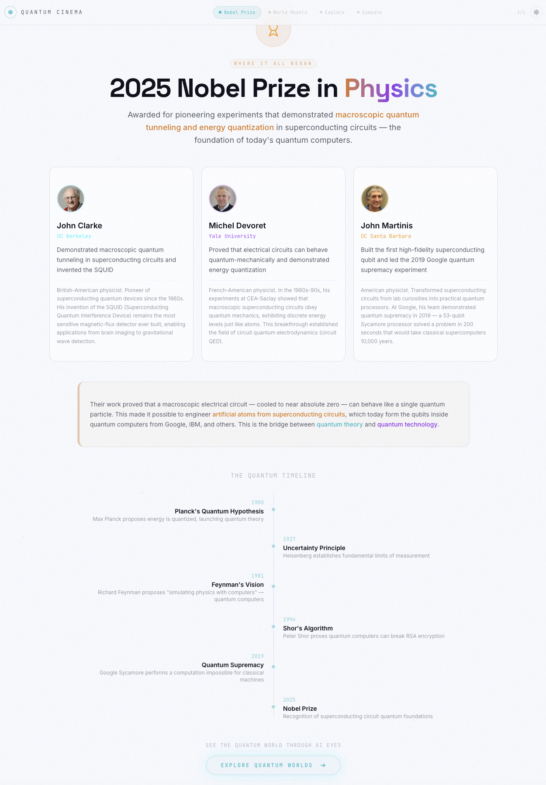
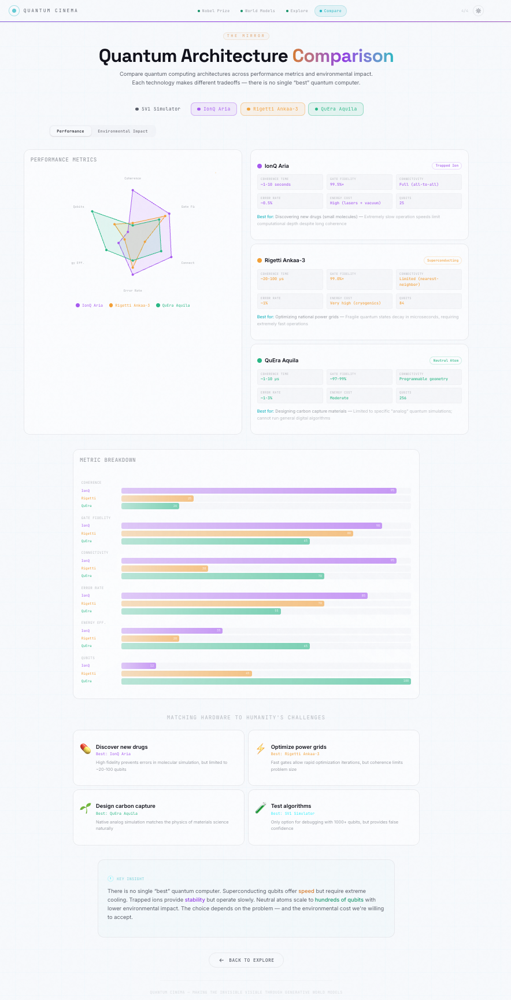

# Quantum Cinema — UI Page Descriptions

This document provides a **technical, implementation-oriented walkthrough** of each surface in the **Quantum Cinema** experience. It is written for engineers, designers, researchers, and reviewers who require a structured understanding of **screen purpose, user flow, what is rendered, and technical context**.

The UI documentation reflects the four-act flow implemented in [`quantum-cinema/src/app/page.tsx`](../../../quantum-cinema/src/app/page.tsx) and aligns with the system architecture described in [`architecture.md`](../architecture.md).

> ✅ **Scientific Note**
> The immersive 3D worlds are **generative world models** — AI-dreamed scenes hosted on World Labs ([marble.worldlabs.ai](https://marble.worldlabs.ai)) — not filmed footage. The device metrics (coherence, fidelity, connectivity, error rate, qubit count) are curated from real AWS Braket hardware characteristics. No live quantum machine is in the request path. Full design rationale: [`design/design.md`](../../../design/design.md).

---

## 🔬 Background

Quantum Cinema closes the **imagination gap** between quantum computing's impact and the public's ability to picture it. Rather than filming hardware (impossible — the action is sub-atomic and sealed inside a refrigerator), it uses generative world models to render hidden quantum worlds as something you can see and move through, conditioned on real device characteristics.

The experience makes three invisible forces observable as visual narrative:

- ❄️ **Decoherence** — qubits losing their quantum state to environmental noise
- 💡 **Laser Cooling** — bombarding atoms with light to slow them to microkelvins
- 🔥 **Energy Loss** — heat dissipation destroying quantum information

---

## 📚 Contents

- [UX Flow Summary](#ux-flow-summary)
- [Screens](#screens)
  - [1. 🏅 Act 1 — Nobel Prize](#1--act-1--nobel-prize-page-1png)
  - [2. 🎞️ Act 2 — World Models](#2-️-act-2--world-models-page-2png)
  - [3. 🌌 Act 3 — Explore](#3--act-3--explore-no-screenshot)
  - [4. 📊 Act 4 — Comparison](#4--act-4--comparison-page-3png)
- [🌐 Interdisciplinary Contributions & SDG Alignment](#-interdisciplinary-contributions--sdg-alignment)
- [📖 Glossary](#-glossary)
- [⚖️ Limitations & Non-Claims](#️-limitations--non-claims)

---

## UX Flow Summary

The interface is a **four-act guided flow** that moves the viewer from *why quantum matters* to *a hands-on understanding of why no single quantum computer wins*.

  

    <b>🧭 Experience Flow</b>
    <ul>
      <li>🏅 Act 1 — Nobel Prize (why it matters, and why now)</li>
      <li>🎞️ Act 2 — World Models (watch the invisible become visible)</li>
      <li>🌌 Act 3 — Explore (step inside the machine you chose)</li>
      <li>📊 Act 4 — Comparison (why there is no single "best")</li>
    </ul>
  

  

    <b>🗂️ State Captured</b>
    <ul>
      <li>Current act (<code>currentStep</code>, 0–3)</li>
      <li>Selected device (<code>selectedDevice</code>: ion-trap / superconducting / neutral-atoms)</li>
      <li>Comparison selection + active view (Performance / Environmental)</li>
      <li>Theme preference (dark / light, persisted in localStorage)</li>
    </ul>
  

| Principle | Surface | Purpose |
|---|---|---|
| **Engage → Choose** | Act 1–2 | Open with a historic award, then let affective response to AI-dreamed clips drive device choice |
| **Watch → Understand** | Act 3 | Step inside the chosen world; map entanglement element-by-element onto what you see |
| **Contrast → Insight** | Act 4 | Compare architectures across six axes; the trade-offs *are* the science |

> 📸 The three captured screenshots correspond to **Act 1** (`page-1.png`), **Act 2** (`page-2.png`), and **Act 4** (`page-3.png`). Act 3 hands off to an external World Labs scene and is described in text below.

---

## Screens

---

### 1. 🏅 Act 1 — Nobel Prize (`page-1.png`)

<figure style="margin:16px 0; padding:12px; border:1px solid #e5e7eb; border-radius:14px;">
  
  <figcaption><b>Figure 1.</b> The opening act — the 2025 Nobel laureates and a 125-year quantum timeline.</figcaption>
</figure>

**Purpose**

Answer "why does this matter — and why now?" by anchoring the experience in the **2025 Nobel Prize in Physics** for macroscopic quantum tunnelling in superconducting circuits.

**What You See**

- Three laureate cards — **John Clarke** (UC Berkeley), **Michel Devoret** (Yale), **John Martinis** (UC Santa Barbara) — each with portrait, affiliation, contribution, and bio (portraits served from `/laureates/`)
- A significance callout explaining how superconducting circuits became artificial atoms
- A **125-year timeline**: 1900 Planck → 1927 Uncertainty → 1981 Feynman → 1994 Shor → 2019 Quantum Supremacy → 2025 Nobel

**User Actions**

- Read the laureates and timeline
- Click **Explore Quantum Worlds** to advance to Act 2

**Technical Context**

- Component: `NobelPrizeStep.tsx`; laureate and milestone data are inline constants
- Advancing calls `onNext()`, incrementing `currentStep` in `page.tsx`

---

### 2. 🎞️ Act 2 — World Models (`page-2.png`)

<figure style="margin:16px 0; padding:12px; border:1px solid #e5e7eb; border-radius:14px;">
  
  <figcaption><b>Figure 2.</b> AI-dreamed documentary clips of three quantum architectures, with an entanglement explainer. Selecting a device advances to Explore.</figcaption>
</figure>

**Purpose**

Show the invisible becoming visible: short AI-dreamed clips of three real architectures, framed by a plain-language explainer of **quantum entanglement** and how each machine creates it differently.

**What You See**

- A "What is Quantum Entanglement?" section with three cards summarizing each architecture's entanglement mechanism (shared chain motion · local chip couplers · spatial Rydberg interactions)
- Three video cards (autoplay/loop/muted) for **IonQ Aria — Light Suspension**, **Rigetti Ankaa-3 — Frozen Forge**, **QuEra Aquila — Wave Garden**, each with coherence/fidelity/qubit metrics
- An **Explore This World** button per device

**User Actions**

- Watch the clips and read the entanglement summaries
- Click **Explore This World** on a device → calls `onSelectDevice(deviceId)`, which sets `selectedDevice` and advances to Act 3
- Or go **Back** to Act 1

**Technical Context**

- Component: `VideoShowcaseStep.tsx`; videos from `/videos/*.mp4`
- `DeviceId` is one of `ion-trap` | `superconducting` | `neutral-atoms`

---

### 3. 🌌 Act 3 — Explore (no screenshot)

> This act hands off to an external **World Labs** generative scene opened in a new browser tab, so there is no captured screenshot in this folder.

**Purpose**

Let the viewer step *inside* the machine they chose and understand how entanglement physically happens in that specific architecture, mapped element-by-element onto what they see in the 3D world.

**What You See**

- An **Explore {World} in 3D** button that opens the device's World Labs scene in a new tab
- A **How It Works** card: the core idea of entanglement for this device, plus a "what you see in the world model" map (visual element → physical meaning)
- A detailed explanation and a beginner analogy, side by side
- A **Best For** application callout (e.g. drug discovery, power-grid optimization, carbon-capture materials)

**User Actions**

- Click to open the immersive World Labs scene (`window.open(url, "_blank", "noopener,noreferrer")`)
- Read the entanglement breakdown
- **Try Another Device** (back) or **Compare Architectures** (next)

**Technical Context**

- Component: `WorldModelStep.tsx`; `DEVICE_CONFIGS` maps the `deviceId` prop to a hardcoded `marble.worldlabs.ai` scene URL and the teaching content

---

### 4. 📊 Act 4 — Comparison (`page-3.png`)

<figure style="margin:16px 0; padding:12px; border:1px solid #e5e7eb; border-radius:14px;">
  
  <figcaption><b>Figure 3.</b> Six-axis radar comparison with Performance / Environmental Impact tabs, a metric breakdown, and application matching.</figcaption>
</figure>

**Purpose**

Deliver the punchline: there is no single "best" quantum computer. Each architecture is a master of one task and helpless at another — and the trade-offs are the science.

**What You See**

- A device selector (toggle IonQ · Rigetti · QuEra in/out of the comparison; at least one stays selected)
- A **Performance / Environmental Impact** tab switch
- A six-axis **radar chart** and a per-metric **bar breakdown**
- An **application → best device** matching grid (💊 drug discovery → IonQ, ⚡ power grids → Rigetti, 🌱 carbon capture → QuEra)
- A "key insight" callout summarizing the speed/stability/scale/energy trade-offs

**User Actions**

- Add/remove devices from the comparison
- Switch between performance and environmental views
- Go **Back** to Explore

**Technical Context**

- Component: `ComparisonStep.tsx`; normalized 0–100 `scores`/`envImpact` per device drive `RadarChart.tsx`
- `Error Rate` is inverted so "outward = better" across performance axes

---

## 🌐 Interdisciplinary Contributions & SDG Alignment

Quantum Cinema sits at the intersection of generative AI, scientific communication, and accessible computing. Each act is both a user-interaction step and a contribution toward broader public understanding.

| Surface | Focus (F) · Contribution (C) · Insight (I) | Communities Engaged | UN SDGs |
|---|---|---|---|
| 🏅 **Act 1 — Nobel Prize** | **F:** Anchor quantum relevance in a 2025 milestone. **C:** Translate a Nobel-level result into a public-legible narrative. **I:** Show that scientific recognition can be a doorway, not a barrier. | 📣 Public · 📚 Educators · 👩‍🔬 Researchers | SDG 4 · SDG 9 |
| 🎞️ **Act 2 — World Models** | **F:** Render invisible quantum hardware as AI-dreamed cinema. **C:** Use generative world models for scientific epistemology, not entertainment. **I:** Demonstrate a new medium for communicating physics. | 🎨 Designers · 📚 Educators · 📣 Public | SDG 4 · SDG 9 |
| 🌌 **Act 3 — Explore** | **F:** Map entanglement onto an explorable 3D world. **C:** Provide element-by-element grounding of an abstract phenomenon. **I:** Turn "spooky action" into something navigable. | 👩‍🔬 Researchers · 📚 Educators · 📣 Public | SDG 4 · SDG 9 |
| 📊 **Act 4 — Comparison** | **F:** Compare architectures across performance and environmental cost. **C:** Surface trade-offs (speed/stability/scale/energy) including sustainability. **I:** Reframe "which is best?" as "best for what, at what cost?" | 💼 Investors · ⚖️ Governance · 🌱 Sustainability · 📣 Public | SDG 7 · SDG 9 · SDG 12 · SDG 13 |

### Community Legend

- 👩‍🔬 **Researchers** — scientific discovery and method
- 🎨 **Designers** — interaction and experience
- 📚 **Educators** — knowledge transfer and literacy
- 💼 **Investors** — strategic ecosystem perspectives
- ⚖️ **Governance** — regulation and oversight
- 🌱 **Sustainability** — environmental and lifecycle considerations
- 📣 **Public** — non-specialist participants

---

## 📖 Glossary

| Term | Definition |
|------|------------|
| Generative World Model | An AI system that learns to predict/simulate physical reality and renders it as a navigable 3D scene. |
| World Labs | The platform ([marble.worldlabs.ai](https://marble.worldlabs.ai)) hosting the generative scenes embedded in Act 3. |
| Decoherence | The loss of a qubit's quantum state to environmental noise. |
| Coherence Time | How long a qubit stays "quantum" before decoherence destroys its superposition. |
| Gate Fidelity | Accuracy of a quantum operation (e.g. 99.9% ≈ 1 error per 1000 ops). |
| Connectivity | How many other qubits each qubit can directly interact with. |
| Entanglement | A link between qubits such that measuring one determines the state of the other. |
| Four-Act Flow | The Nobel → World Models → Explore → Compare state machine in `page.tsx`. |
| DeviceId | The explorable architecture key: `ion-trap` / `superconducting` / `neutral-atoms`. |

---

## ⚖️ Limitations & Non-Claims

Quantum Cinema is a **science-communication demonstration**:

- The 3D worlds are **generative (AI-dreamed)**, not recordings of real hardware.
- Device metrics are **curated, representative** values from real AWS Braket architectures, not live calibration data pulled at request time.
- There is **no live quantum execution** in the request path — the experience is fully browser-side over a static site.
- The goal is to make quantum computing legible and intuitive, not to provide operational quantum results.
