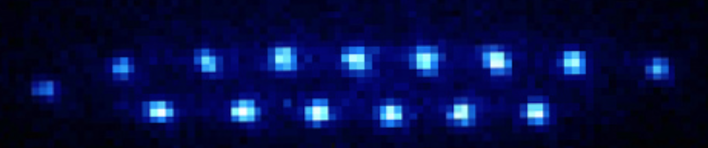
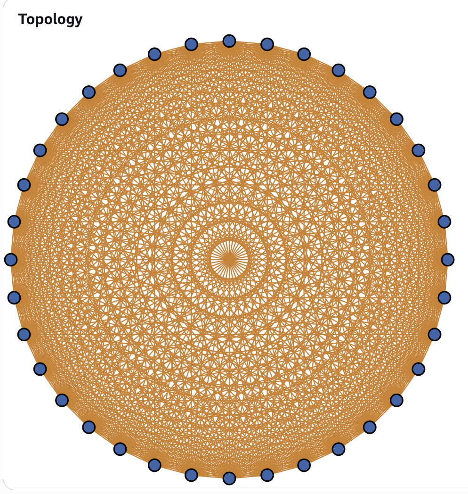

# IonQ Trapped-Ion World Model — Marble

## World Model Link

[Explore on Marble (World Labs)](https://marble.worldlabs.ai/world/ec99b4d4-6431-4224-a816-836819564282)

---

## How the Final World Model Was Generated

The explorable world model was produced in four stages: gather grounded reference images → fuse them into a single concept image with Nano-Banana → lift that concept image into an explorable 3D world with Marble → explore and capture the world. Each stage feeds the next.

### Step 1 — Gather reference inputs

Two external images were collected as visual grounding. Each is stored locally and cited to its original source below.

**`nano-banana-input-concept-ionized-yb-atoms.png`** — the *concept* input: a row of singly-ionized ytterbium atoms imaged as discrete blue fluorescence points — a real Coulomb crystal of trapped ions. This establishes what the qubits physically are. The file is a crop of the full source figure, kept locally as `original.png` to ensure good quality.

> Source: "Many-body Physics with Trapped Ions," Quantum Metrology Group (QUACCS) — https://www.quantummetrology.de/quaccs/research/projects/many-body-physics-with-trapped-ions/

**`nano-banana-input-device-ionq.png`** — a *device* input: the qubit-connectivity topology of an IonQ trapped-ion processor, drawn as a circular all-to-all graph in which every qubit links to every other. This grounds the architecture's defining all-to-all connectivity.

> Source: Robertson, Doucet, Spicer, and Deffner, "Simon's algorithm in the NISQ cloud" (UMBC / National Quantum Laboratory), image 3 — https://arxiv.org/pdf/2406.11771

### Step 2 — Fuse inputs into a concept image with Nano-Banana

The two input images above were supplied to Nano-Banana together with the [Nano-Banana Prompt](#nano-banana-prompt) and [Refinement Notes](#refinement-notes) below. Nano-Banana fused the trapped-ion qubit concept with the all-to-all connectivity idea, producing a single scientifically grounded still:

**`nano-banana-output.jpg`** — the fused concept image: a wide, symmetric view of a suspended linear ion chain of luminous blue-white qubit orbs inside a dark vacuum chamber, with gold-violet Raman beams entering from multiple directions and a faint shared vibrational field linking the ions — no wires between them.

### Step 3 — Lift the concept image into an explorable world with Marble

`nano-banana-output.jpg` was then used as the **reference image** for Marble (World Labs), together with the [Marble Prompt](#marble-prompt) below. Marble lifts the single still into a navigable, photorealistic 3D world: [Explore on Marble](https://marble.worldlabs.ai/world/7f7dcf51-4c04-407d-9000-eb3321432fb3).

### Step 4 — Explore and capture

The world was navigated and captured as still frames (`ion-trap-screenshots/ion-1.jpg` … `ion-5.jpg`) and a fly-through recording (`ionq-world-explore.mp4`). These captures are the final deliverables.

---

## Nano-Banana Prompt

> An explorable trapped-ion quantum world inside a vast dark resonance cathedral, not a museum. A circular vacuum-like chamber contains a suspended ring-like ion chain of luminous qubit orbs, each floating in precise equilibrium with no hard wires between them. The center of the world contains a faint shared vibrational field, like a living harmonic membrane or standing-wave body that all ions belong to. Two narrow Raman-like laser beams enter from different directions and illuminate selected ions, causing ripples through the collective medium. When entanglement forms, do not show a simple cable between the ions; instead show a beautiful shared standing-wave structure through the whole chamber, with the selected ions phase-locking to the same harmonic field. The world should feel calm, precise, vacuum-clean, physically coherent, and deeply quantum. No gallery walls, no exhibits, no signage, no chip traces, no city, minimal clutter, elegant radial symmetry, deep indigo and black environment, blue-white ions, subtle gold-violet laser light, immersive and explorable.

### Refinement Notes

- Remove any museum, stage, or exhibition-hall feeling
- Make the chamber feel like a real trapped-ion quantum environment inside a shared resonant vacuum
- Replace static decorative webbing with dynamic harmonic field structure
- Keep the qubits suspended and isolated, but show that any pair can couple through one collective vibrational medium rather than through fixed local wires
- Increase the sense of radial symmetry, laser addressing, and shared motion

---

## Marble Prompt

> The scene is a vast, dark resonance cathedral, designed in a hyper-realistic style with a calm, precise, and deeply quantum tone. The environment emphasizes radial symmetry, vacuum-clean aesthetics, and a minimal, elegant design, devoid of clutter or typical museum elements. A circular vacuum-like chamber, centrally located, houses a suspended ring-like ion chain composed of luminous qubit orbs, each floating in precise equilibrium without any visible hard wires. The central space within this ring-like chain contains a faint, shared vibrational field, manifesting as a living harmonic membrane or standing-wave body to which all ions belong. Narrow Raman-like laser beams, subtly gold-violet in color, enter the chamber from various directions, illuminating selected ions and creating ripples through the collective medium. When entanglement forms between ions, it is visualized not as simple connections but as a beautiful, shared standing-wave structure extending through the entire chamber, with the selected ions phase-locking to the same harmonic field. The cathedral's interior walls are a deep indigo and black, devoid of gallery displays, exhibits, or signage, and the blue-white ions glow with an ethereal light, creating an immersive and explorable quantum world.

---

## Images

These are the artifacts of the pipeline described in [How the Final World Model Was Generated](#how-the-final-world-model-was-generated).

### Nano-Banana Input Images (external references)

> Source: "Many-body Physics with Trapped Ions," Quantum Metrology Group (QUACCS) — https://www.quantummetrology.de/quaccs/research/projects/many-body-physics-with-trapped-ions/ (cropped from `original.png`)

> Source: Robertson et al., "Simon's algorithm in the NISQ cloud," image 3 — https://arxiv.org/pdf/2406.11771

### Nano-Banana Output (Marble reference image)

### World Exploration Video
[ionq-world-explore.mp4](ionq-world-explore.mp4)

---

## Using This World to Teach

For how to explain quantum entanglement using the captured frames of this world, see **[teaching-guide.md](teaching-guide.md)**.
