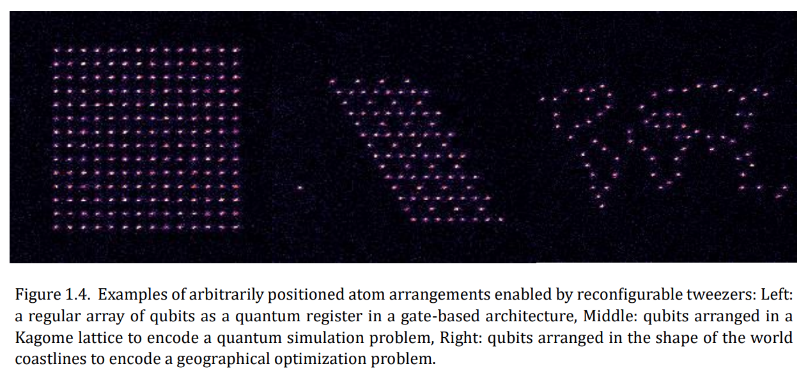
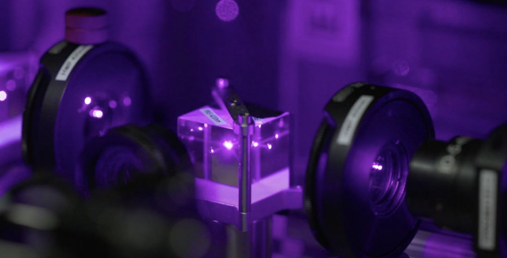
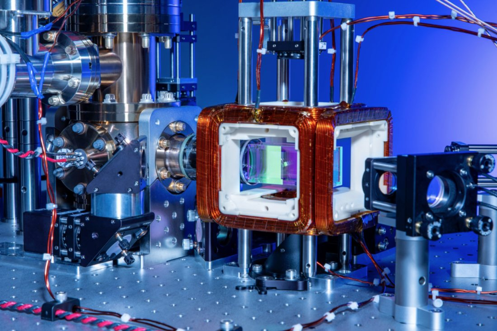

# Neutral-Atom World Model — Marble

## World Model Link

[Explore on Marble (World Labs)](https://marble.worldlabs.ai/world/a6617b56-2638-48cb-8202-340ddaf831e4)

---

## How the Final World Model Was Generated

The explorable world model was produced in four stages: gather grounded reference images → fuse them into a single concept image with Nano-Banana → lift that concept image into an explorable 3D world with Marble → explore and capture the world. Each stage feeds the next.

### Step 1 — Gather reference inputs

Three external images were collected as visual grounding. Each is stored locally and cited to its original source below.

**`nano-banana-input-concept-atom-arrangements.png`** — the *concept* input: arbitrarily positioned atom arrangements enabled by reconfigurable optical tweezers (regular array, Kagome lattice, geographic coastline pattern). This establishes the programmable-geometry idea.

> Source: Wurtz et al., "Aquila: QuEra's 256-qubit neutral-atom quantum computer," Figure 1.4 — https://arxiv.org/abs/2306.11727

**`nano-banana-input-device-quera-hpcwire.jpg`** — a *device* input: a photograph of QuEra's neutral-atom optics (prisms, objective lenses, laser light) under purple illumination. This grounds the optical-access aesthetic.

> Source: HPCwire, "QuEra's Quest: Build a Flexible Neutral-Atom-Based Quantum Computer" (2022-11-23) — https://www.hpcwire.com/2022/11/23/queras-quest-build-a-flexible-neutral-atom-based-quantum-computer/

**`nano-banana-input-device-quera-aws.jpg`** — a second *device* input: the ultra-high-vacuum chamber with copper coils, optical-table mounts, and red wiring. This grounds the realistic vacuum-chamber housing.

> Source: AWS Braket — QuEra quantum computers — https://aws.amazon.com/braket/quantum-computers/quera/

### Step 2 — Fuse inputs into a concept image with Nano-Banana

The three input images above were supplied to Nano-Banana together with the [Nano-Banana Prompt](#nano-banana-prompt) and [Refinement Notes](#refinement-notes) below. Nano-Banana fused the programmable-geometry concept with the real device optics and chamber, producing a single scientifically grounded still:

**`nano-banana-output.jpg`** — the fused concept image: a realistic vacuum chamber viewed head-on, with a dense ~16×16 green optical-tweezer array, thin red/violet control beams crossing the trap, and a soft Rydberg-blockade halo around an excited site near the center.

### Step 3 — Lift the concept image into an explorable world with Marble

`nano-banana-output.jpg` was then used as the **reference image** for Marble (World Labs), together with the [Marble Prompt](#marble-prompt) below. Marble lifts the single still into a navigable, photorealistic 3D world: [Explore on Marble](https://marble.worldlabs.ai/world/510dff36-2d42-4686-9651-a9a9d2a65074).

### Step 4 — Explore and capture

The world was navigated and captured as still frames (`neutral-atom-screenshots/atom-1.jpg` … `atom-5.jpg`) and a fly-through recording (`quera.mp4`). These captures are the final deliverables.

---

## Nano-Banana Prompt

> Improve this into a scientifically grounded visualization inside a real neutral-atom quantum computer. Show a realistic ultra-high-vacuum chamber with optical access, objective lenses, prisms, and a central optical-tweezer trapping region. Inside the trap, display a large programmable array of about 200 to 256 clearly separated neutral-atom qubits as small bright fluorescence points arranged in a clean 2D array or shallow 3D pattern. The image must communicate two ideas at once: many analog qubits working together, and entanglement emerging through local interaction. Most of the array should remain visible and countable, showing hundreds of qubits simultaneously present. In one highlighted local region, one or two atoms are excited and create small soft Rydberg-blockade halos. Around that region, nearby atoms show subtle correlated behavior: local brightness suppression, alternating bright and dim sites, or a small ordered patch spreading across neighboring atoms.

### Refinement Notes

- Do not use explicit connecting lines, graph edges, wires, lightning arcs, or chip traces
- Entanglement should appear as a local interaction zone plus a coordinated many-body pattern across several nearby atoms, while the rest of the large array remains visible in the background
- Keep the optics realistic, the beams thin and subtle, the chamber dark and metallic
- Overall style: physically grounded, clean, and publication-quality

---

## Marble Prompt

> The scene is a high-tech scientific environment, captured with a photorealistic precision that emphasizes a sense of meticulous control and advanced quantum mechanics. The overall tone is one of scientific wonder and intricate sophistication, showcasing a world of precise interactions at an atomic level. At the center of the visual field is a large, ultra-high-vacuum optical chamber, a gleaming metallic structure with numerous bolted flanges and copper wiring encircling its exterior, indicating complex electromagnetic controls. Inside this chamber, a programmable 2D array of neutral atoms is suspended, each atom appearing as a luminous green point held within a precise optical-tweezer trap, creating a geometric pattern of light against the dark vacuum. Some regions of this array form straight lines, others triangles, dense square lattices, and sparse clusters, demonstrating the reconfigurable nature of the qubit layout. Multiple laser beams, ranging from subtle red to violet, emanate from various entry points around the chamber, intersecting and illuminating elements within the vacuum, signifying precise scientific control. One or two atoms within the array are noticeably more luminous, indicating excitation into a higher interacting state, and around these excited atoms, soft luminous Rydberg-blockade halos are visible, subtly preventing nearby atoms from entering the same state and making the interaction radius intuitively apparent. Entanglement manifests as a geometry-dependent collective behavior spreading across adjacent atoms, rather than through fixed wires or circuit gates, underscoring the continuous analog evolution of the quantum system. The dark vacuum of the chamber, the metallic gleam of the optical housing, the vibrant green glow of the atom array, and the subtle red-violet laser accents all contribute to a physically real, precise, airy, and quantum-mechanical atmosphere, devoid of clutter.

---

## Images

These are the artifacts of the pipeline described in [How the Final World Model Was Generated](#how-the-final-world-model-was-generated).

### Nano-Banana Input Images (external references)

> Source: Wurtz et al., Aquila (Fig. 1.4) — https://arxiv.org/abs/2306.11727

> Source: HPCwire (2022-11-23) — https://www.hpcwire.com/2022/11/23/queras-quest-build-a-flexible-neutral-atom-based-quantum-computer/

> Source: AWS Braket — https://aws.amazon.com/braket/quantum-computers/quera/

### Nano-Banana Output (Marble reference image)

### World Exploration Video
[quera.mp4](quera.mp4)

---

## Using This World to Teach

For how to explain quantum entanglement using the captured frames of this world, see **[teaching-guide.md](teaching-guide.md)**.
