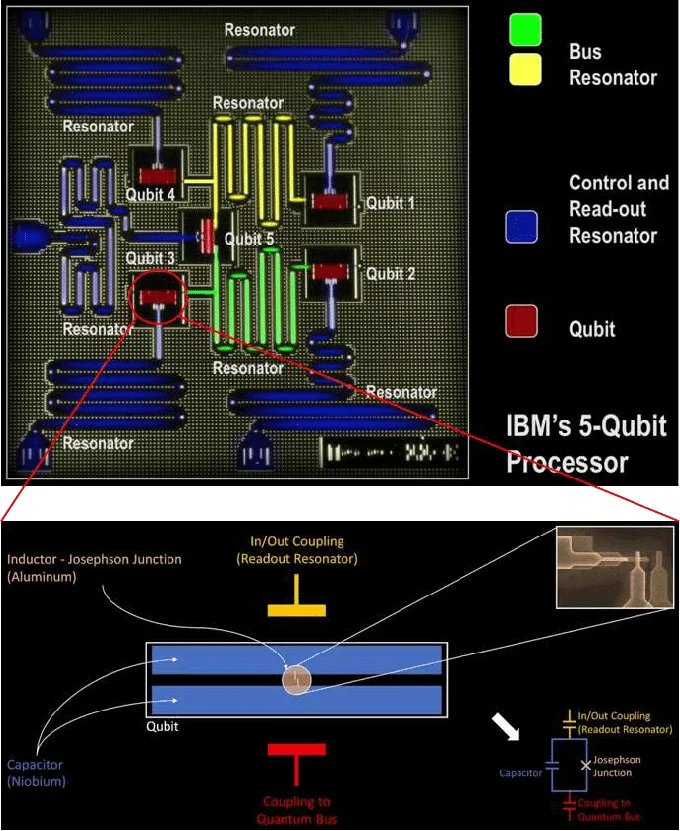
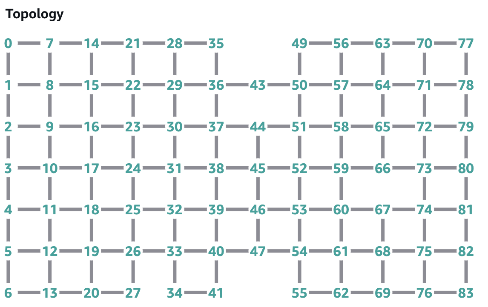

# Superconducting World Model — Marble

## World Model Link

[Explore on Marble (World Labs)](https://marble.worldlabs.ai/world/ab1c9b71-d71a-4253-914d-51a70a2c8ab2)

---

## How the Final World Model Was Generated

The explorable world model was produced in four stages: gather grounded reference images → fuse them into a single concept image with Nano-Banana → lift that concept image into an explorable 3D world with Marble → explore and capture the world. Each stage feeds the next.

### Step 1 — Gather reference inputs

Two external images were collected as visual grounding. Each is stored locally and cited to its original source below.

**`nano-banana-input-concept-josephson-junction.jpg`** — the *concept* input: a labeled micrograph of IBM's 5-qubit processor together with a schematic of a transmon qubit (capacitor pads, Josephson junction, readout and bus coupling). This establishes what a superconducting qubit and its on-chip couplings actually are.

> Source: Pashupati Dhakal, "Superconducting Radio Frequency Resonators for Quantum Computing: A Short Review," Figure 4.

**`nano-banana-input-device-rigetti.png`** — a *device* input: the qubit-connectivity topology of a Rigetti superconducting processor, drawn as a square-lattice graph of numbered qubits with nearest-neighbor links. This grounds the chip's fixed, local connectivity.

> Source: AWS Braket blog — "Amazon Braket launches the Rigetti Ankaa-2 superconducting device" — https://aws.amazon.com/blogs/quantum-computing/amazon-braket-launches-the-rigetti-ankaa-2-superconducting-device-2/

### Step 2 — Fuse inputs into a concept image with Nano-Banana

The two input images above were supplied to Nano-Banana together with the [Nano-Banana Prompt](#nano-banana-prompt) and its [Refinement Notes](#refinement-notes), [Material Language](#material-language), and [Avoid](#avoid) constraints. Nano-Banana fused the transmon/qubit concept with the chip's square-lattice topology, producing a single scientifically grounded still:

**`nano-banana-output.jpg`** — the fused concept image: a cryogenic chip-city rendered at a low immersive angle, a sparse square-lattice of transmon-like qubit pads connected by short engineered traces, with a single bright local coupler bridge activating between two neighboring nodes.

### Step 3 — Lift the concept image into an explorable world with Marble

`nano-banana-output.jpg` was then used as the **reference image** for Marble (World Labs), together with the [Marble Prompt](#marble-prompt) below. Marble lifts the single still into a navigable, photorealistic 3D world: [Explore on Marble](https://marble.worldlabs.ai/world/ab1c9b71-d71a-4253-914d-51a70a2c8ab2).

### Step 4 — Explore and capture

The world was navigated and captured as still frames (`superconducting-screenshots/super-1.jpg` … `super-5.jpg`) and a fly-through recording (`superconducting-world-explore.mp4`). These captures are the final deliverables.

---

## Nano-Banana Prompt

> An explorable superconducting quantum world inside a colossal cryogenic chip city at near absolute zero. The environment is built directly into the surface of a superconducting quantum processor: a vast rectilinear metallic-blue landscape of planar qubit districts, square-grid corridors, etched control traces, resonator-like towers, and short glowing tunable coupler bridges between neighboring nodes. Luminous superconducting qubit sites are embedded in the chip surface in a sparse square-lattice pattern, with a few missing nodes and irregular fabrication gaps to make the world feel real and explorable. Electronic control pulses travel through traces and couplers like fast engineered currents, hugging the chip pathways. When two neighboring qubits entangle, show a bright local bridge event across a short coupler, like amplitude exchange through a tuned superconducting link. Do not show long-range magical beams or an all-to-all floating web. Distant qubits must feel reachable only by moving across routes in the grid.

### Refinement Notes

- Keep the same low-angle immersive chip-city composition, but make the scene look more like real superconducting quantum hardware and less like a generic sci-fi motherboard
- Replace the glowing square nodes with transmon-like qubit structures: metallic capacitor pads, small junction regions, planar superconducting islands, and microwave circuit geometry
- Make all connections local and physically engineered, using short tunable coupler bridges between neighboring qubits only
- The central interaction should not look like lightning or plasma — show a bright, short, controlled coupler activation between two nearby qubits, like a localized superconducting bridge event or microwave-mediated exchange
- Keep the chip surface extremely planar, lithographic, precise, rectilinear, sparse, and cold
- Reduce the visual dominance of the giant pillars; if vertical elements remain, make them feel like cryogenic package supports or resonator towers integrated into the chip environment, not architectural columns
- Emphasize etched coplanar waveguides, resonator-like structures, superconducting traces, brushed niobium and aluminum textures, frost, deep blue shadows, teal highlights, and near-absolute-zero stillness

### Material Language

Cryogenic silver, brushed niobium, frosted aluminum, teal glow, deep blue shadows, subtle ice crystals, superconducting stillness, ultra-clean fabrication, precise lithographic geometry, near-zero thermal atmosphere.

### Avoid

- No gallery walls, no organic plants, no fantasy crystals, no steampunk clutter
- No circular alien city, no abstract cyberspace
- No floating all-to-all network, no mystical laser beams between distant qubits
- No fantasy temple, no museum exhibit, no organic garden, no warm colors
- No dense clutter, no random cyberpunk signage, no curved alien biomorphic shapes
- No steampunk machinery, no glass showroom, no abstract hologram void

---

## Marble Prompt

> The scene is a superconducting quantum world, rendered in a realistic, high-tech style with a cold and precise tone. The environment is a massive cryogenic chip city, built from a frozen metallic-blue lattice landscape. The primary pathways are planar qubit districts, which form square-grid corridors throughout the entire cityscape. Short, glowing coupler bridges connect neighboring nodes, facilitating the movement of information. Luminous superconducting qubit sites are embedded in the chip surface, arranged in a sparse square-lattice pattern that extends infinitely, though with occasional gaps and irregular breaks. Electronic control pulses are visible as fast, bright currents moving along traces and couplers, akin to traffic flow in a city at near absolute zero. When two neighboring qubits entangle, the interaction manifests as a bright, local bridge event, showing amplitude exchanging through a tuned coupler. Distant qubits are reachable only through intricate routes across the grid, emphasizing the fabricated, rectilinear nature of this quantum metropolis. The entire world is immersed in a palette of cryogenic silver, teal, and deep blue, adorned with frost and numerous resonator-like towers that punctuate the superconducting stillness.

---

## Images

These are the artifacts of the pipeline described in [How the Final World Model Was Generated](#how-the-final-world-model-was-generated).

### Nano-Banana Input Images (external references)

> Source: Pashupati Dhakal, "Superconducting Radio Frequency Resonators for Quantum Computing: A Short Review," Figure 4.

> Source: AWS Braket blog (Rigetti Ankaa-2) — https://aws.amazon.com/blogs/quantum-computing/amazon-braket-launches-the-rigetti-ankaa-2-superconducting-device-2/

### Nano-Banana Output (Marble reference image)

### World Exploration Video
[superconducting-world-explore.mp4](superconducting-world-explore.mp4)

---

## Using This World to Teach

For how to explain quantum entanglement using the captured frames of this world, see **[teaching-guide.md](teaching-guide.md)**.
