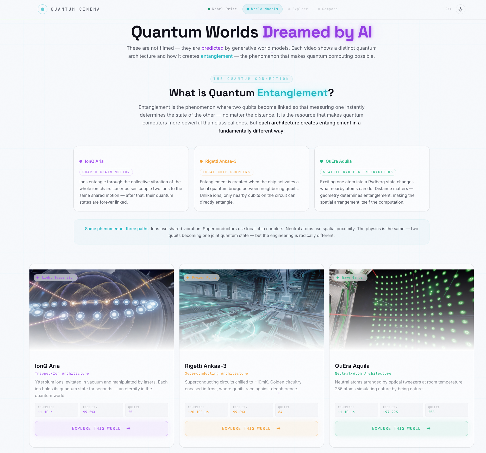

# Quantum Cinema — 界面页面说明

本文档为 **Quantum Cinema** 体验中的每个界面提供**面向实现的技术化讲解**。它面向工程师、设计师、研究者与评审，帮助他们结构化地理解**屏幕用途、用户流程、所渲染的内容与技术背景**。

本界面文档反映了在 [`quantum-cinema/src/app/page.tsx`](../../../quantum-cinema/src/app/page.tsx) 中实现的四幕流程，并与 [`architecture.md`](../architecture.md) 中描述的系统架构保持一致。

> ✅ **科学说明**
> 沉浸式 3D 世界是**生成式世界模型**——由 AI 梦境般生成、托管于 World Labs（[marble.worldlabs.ai](https://marble.worldlabs.ai)）的场景——而非拍摄的影像。设备指标（相干时间、保真度、连通性、错误率、量子比特数）取自真实 AWS Braket 硬件特性并经过整理。请求路径中没有实时量子机器。完整设计背景：[`design/design.md`](../../../design/design.md)。

---

## 🔬 背景

Quantum Cinema 弥合量子计算的影响力与公众想象它的能力之间的**想象力鸿沟**。与其拍摄硬件（不可能——动作发生在亚原子层级且封闭于制冷机内），它使用生成式世界模型，将隐藏的量子世界渲染为你可以看见、可以穿行的事物，并以真实设备特性为条件。

该体验将三种不可见的力量呈现为可观察的视觉叙事：

- ❄️ **退相干**——量子比特因环境噪声而失去量子态
- 💡 **激光冷却**——用光轰击原子使其减速至微开尔文
- 🔥 **能量损耗**——热耗散摧毁量子信息

---

## 📚 目录

- [UX 流程概览](#ux-流程概览)
- [屏幕](#屏幕)
  - [1. 🏅 第 1 幕 — 诺贝尔奖](#1--第-1-幕--诺贝尔奖-page-1png)
  - [2. 🎞️ 第 2 幕 — 世界模型](#2-️-第-2-幕--世界模型-page-2png)
  - [3. 🌌 第 3 幕 — 探索](#3--第-3-幕--探索无截图)
  - [4. 📊 第 4 幕 — 对比](#4--第-4-幕--对比-page-3png)
- [🌐 跨学科贡献与 SDG 对齐](#-跨学科贡献与-sdg-对齐)
- [📖 术语表](#-术语表)
- [⚖️ 局限与非主张](#️-局限与非主张)

---

## UX 流程概览

界面是一条**四幕引导式流程**，将观众从*为什么量子重要*引向*为何没有单一"最佳"量子计算机的亲身理解*。

  

    <b>🧭 体验流程</b>
    <ul>
      <li>🏅 第 1 幕 — 诺贝尔奖（为什么重要，以及为什么是现在）</li>
      <li>🎞️ 第 2 幕 — 世界模型（看见不可见之物）</li>
      <li>🌌 第 3 幕 — 探索（步入你选择的机器）</li>
      <li>📊 第 4 幕 — 对比（为何没有单一"最佳"）</li>
    </ul>
  

  

    <b>🗂️ 捕获的状态</b>
    <ul>
      <li>当前幕（<code>currentStep</code>，0–3）</li>
      <li>所选设备（<code>selectedDevice</code>：ion-trap / superconducting / neutral-atoms）</li>
      <li>对比选择 + 当前视图（性能 / 环境）</li>
      <li>主题偏好（深色 / 浅色，持久化于 localStorage）</li>
    </ul>
  

| 原则 | 界面 | 目的 |
|---|---|---|
| **吸引 → 选择** | 第 1–2 幕 | 以一项历史性奖项开场，再让对 AI 梦境片段的情感反应驱动设备选择 |
| **观看 → 理解** | 第 3 幕 | 步入所选世界；逐元素地将纠缠映射到你所见之物 |
| **对比 → 洞见** | 第 4 幕 | 在六个维度上对比架构；权衡本身*就是*科学 |

> 📸 三张捕获的截图分别对应**第 1 幕**（`page-1.png`）、**第 2 幕**（`page-2.png`）与**第 4 幕**（`page-3.png`）。第 3 幕移交给外部的 World Labs 场景，将在下文以文字描述。

---

## 屏幕

---

### 1. 🏅 第 1 幕 — 诺贝尔奖 (`page-1.png`)

<figure style="margin:16px 0; padding:12px; border:1px solid #e5e7eb; border-radius:14px;">
  
  <figcaption><b>图 1。</b> 开篇之幕——2025 年诺贝尔奖获得者与一条 125 年的量子时间线。</figcaption>
</figure>

**用途**

通过将体验锚定在表彰超导电路中宏观量子隧穿的 **2025 年诺贝尔物理学奖**上，回答"为什么这重要——以及为什么是现在？"。

**你会看到**

- 三张获奖者卡片——**John Clarke**（UC Berkeley）、**Michel Devoret**（Yale）、**John Martinis**（UC Santa Barbara）——每张含肖像、所属机构、贡献与简介（肖像来自 `/laureates/`）
- 一段意义说明，解释超导电路如何成为人造原子
- 一条 **125 年时间线**：1900 普朗克 → 1927 不确定性原理 → 1981 费曼 → 1994 Shor → 2019 量子优越性 → 2025 诺贝尔奖

**用户操作**

- 阅读获奖者与时间线
- 点击 **Explore Quantum Worlds** 进入第 2 幕

**技术背景**

- 组件：`NobelPrizeStep.tsx`；获奖者与里程碑数据为内联常量
- 前进调用 `onNext()`，使 `page.tsx` 中的 `currentStep` 递增

---

### 2. 🎞️ 第 2 幕 — 世界模型 (`page-2.png`)

<figure style="margin:16px 0; padding:12px; border:1px solid #e5e7eb; border-radius:14px;">
  
  <figcaption><b>图 2。</b> 三种量子架构的 AI 梦境式纪录片片段，配以纠缠讲解。选择设备即进入"探索"。</figcaption>
</figure>

**用途**

展现不可见之物变得可见：三段真实架构的 AI 梦境式短片，辅以一段通俗语言的**量子纠缠**讲解，以及每台机器创造纠缠的不同方式。

**你会看到**

- 一个"什么是量子纠缠？"区块，含三张卡片，分别概述各架构的纠缠机制（共享链运动 · 局部芯片耦合器 · 空间 Rydberg 相互作用）
- 三张视频卡片（自动播放/循环/静音），分别为 **IonQ Aria — Light Suspension**、**Rigetti Ankaa-3 — Frozen Forge**、**QuEra Aquila — Wave Garden**，各带相干/保真度/量子比特指标
- 每个设备一个 **Explore This World** 按钮

**用户操作**

- 观看片段并阅读纠缠摘要
- 在某设备上点击 **Explore This World** → 调用 `onSelectDevice(deviceId)`，设置 `selectedDevice` 并进入第 3 幕
- 或返回第 1 幕（**Back**）

**技术背景**

- 组件：`VideoShowcaseStep.tsx`；视频来自 `/videos/*.mp4`
- `DeviceId` 为 `ion-trap` | `superconducting` | `neutral-atoms` 之一

---

### 3. 🌌 第 3 幕 — 探索（无截图）

> 该幕移交给在新浏览器标签页中打开的外部 **World Labs** 生成式场景，因此本目录中没有对应的截图。

**用途**

让观众*步入*他们所选的机器，理解纠缠在该特定架构中是如何物理发生的，并逐元素地映射到他们在 3D 世界中所见之物。

**你会看到**

- 一个 **Explore {World} in 3D** 按钮，在新标签页打开该设备的 World Labs 场景
- 一张 **How It Works** 卡片：该设备纠缠的核心思想，以及一个"你在世界模型中看到了什么"的映射（视觉元素 → 物理含义）
- 并排呈现的详细解释与初学者类比
- 一段 **Best For** 应用说明（如药物发现、电网优化、碳捕集材料）

**用户操作**

- 点击打开沉浸式 World Labs 场景（`window.open(url, "_blank", "noopener,noreferrer")`）
- 阅读纠缠讲解
- **Try Another Device**（返回）或 **Compare Architectures**（前进）

**技术背景**

- 组件：`WorldModelStep.tsx`；`DEVICE_CONFIGS` 将 `deviceId` prop 映射到硬编码的 `marble.worldlabs.ai` 场景 URL 与教学内容

---

### 4. 📊 第 4 幕 — 对比 (`page-3.png`)

<figure style="margin:16px 0; padding:12px; border:1px solid #e5e7eb; border-radius:14px;">
  
  <figcaption><b>图 3。</b> 带"性能 / 环境影响"标签切换的六轴雷达对比、指标分解，以及应用匹配。</figcaption>
</figure>

**用途**

给出点睛之论：没有单一"最佳"的量子计算机。每种架构都是某一任务的大师，却对另一任务束手无策——而权衡本身就是科学。

**你会看到**

- 一个设备选择器（将 IonQ · Rigetti · QuEra 切入/切出对比；至少保留一个被选中）
- 一个 **性能 / 环境影响** 标签切换
- 一张六轴**雷达图**与一份逐项指标**条形分解**
- 一个 **应用 → 最佳设备** 匹配网格（💊 药物发现 → IonQ，⚡ 电网 → Rigetti，🌱 碳捕集 → QuEra）
- 一段"关键洞见"说明，总结速度/稳定性/规模/能耗的权衡

**用户操作**

- 在对比中增删设备
- 在性能与环境视图之间切换
- 返回"探索"（**Back**）

**技术背景**

- 组件：`ComparisonStep.tsx`；每个设备归一化到 0–100 的 `scores`/`envImpact` 驱动 `RadarChart.tsx`
- `Error Rate` 被反转，使各性能轴上"越往外 = 越好"

---

## 🌐 跨学科贡献与 SDG 对齐

Quantum Cinema 位于生成式 AI、科学传播与可及计算的交汇处。每一幕既是一个用户交互步骤，也是面向更广泛公众理解的一份贡献。

| 界面 | 焦点 (F) · 贡献 (C) · 洞见 (I) | 涉及社群 | 联合国 SDG |
|---|---|---|---|
| 🏅 **第 1 幕 — 诺贝尔奖** | **F：** 将量子相关性锚定于 2025 年里程碑。 **C：** 把诺贝尔级成果翻译为公众可读的叙事。 **I：** 表明科学认可可以是门径，而非壁垒。 | 📣 公众 · 📚 教育者 · 👩‍🔬 研究者 | SDG 4 · SDG 9 |
| 🎞️ **第 2 幕 — 世界模型** | **F：** 将不可见的量子硬件渲染为 AI 梦境式影像。 **C：** 把生成式世界模型用于科学认识论，而非娱乐。 **I：** 演示一种传播物理学的新媒介。 | 🎨 设计师 · 📚 教育者 · 📣 公众 | SDG 4 · SDG 9 |
| 🌌 **第 3 幕 — 探索** | **F：** 将纠缠映射到可探索的 3D 世界。 **C：** 为抽象现象提供逐元素的落地解释。 **I：** 将"幽灵般的超距作用"变为可导航之物。 | 👩‍🔬 研究者 · 📚 教育者 · 📣 公众 | SDG 4 · SDG 9 |
| 📊 **第 4 幕 — 对比** | **F：** 在性能与环境成本上对比架构。 **C：** 呈现权衡（速度/稳定性/规模/能耗），含可持续性。 **I：** 把"哪个最好？"重构为"在什么代价下，最适合做什么？" | 💼 投资者 · ⚖️ 治理 · 🌱 可持续性 · 📣 公众 | SDG 7 · SDG 9 · SDG 12 · SDG 13 |

### 社群图例

- 👩‍🔬 **研究者**——科学发现与方法
- 🎨 **设计师**——交互与体验
- 📚 **教育者**——知识传递与素养
- 💼 **投资者**——战略生态视角
- ⚖️ **治理**——监管与监督
- 🌱 **可持续性**——环境与生命周期考量
- 📣 **公众**——非专业参与者

---

## 📖 术语表

| 术语 | 定义 |
|------|------------|
| 生成式世界模型 | 一种学习预测/模拟物理现实并将其渲染为可导航 3D 场景的 AI 系统。 |
| World Labs | 托管第 3 幕所嵌入生成式场景的平台（[marble.worldlabs.ai](https://marble.worldlabs.ai)）。 |
| 退相干 | 量子比特因环境噪声而失去量子态。 |
| 相干时间 | 量子比特在退相干摧毁其叠加态之前保持"量子性"的时长。 |
| 门保真度 | 一次量子操作的准确度（如 99.9% ≈ 每 1000 次操作 1 次错误）。 |
| 连通性 | 每个量子比特能直接交互的其他量子比特数量。 |
| 纠缠 | 量子比特之间的关联，使得测量其一即可确定另一者的状态。 |
| 四幕流程 | `page.tsx` 中的 诺贝尔奖 → 世界模型 → 探索 → 对比 状态机。 |
| DeviceId | 可探索架构键：`ion-trap` / `superconducting` / `neutral-atoms`。 |

---

## ⚖️ 局限与非主张

Quantum Cinema 是一个**科学传播演示系统**：

- 3D 世界是**生成式（AI 梦境）**的，并非真实硬件的录像。
- 设备指标是来自真实 AWS Braket 架构的**经过整理的、代表性**数值，而非在请求时拉取的实时校准数据。
- 请求路径中**没有实时量子执行**——该体验完全在浏览器端、基于静态站点运行。
- 目标是让量子计算变得可读且直观，而非提供可操作的量子结果。
